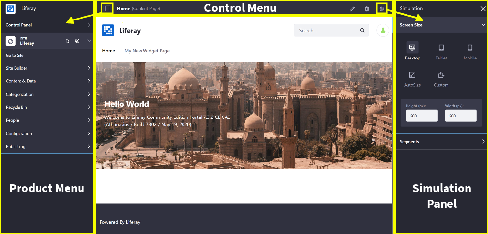
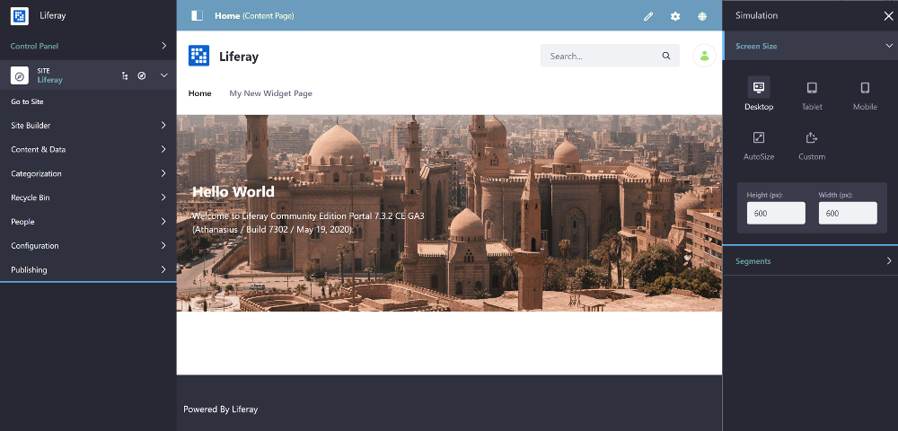

# Packaging Independent UI Resources for Your Site

You can create a *Theme Contributor* to include independent CSS and JavaScript resources, separate from a Theme, on every page. For example, the Control Menu, Product Menu, and Simulation Panel are packaged as Theme Contributors.



If you want to edit or style these standard UI components, you must create a Theme Contributor and add your modifications on top. You can also add new UI components to LIferay DXP by creating a Theme Contributor. You can create a Theme Contributor in just a few steps:

1. [Deploy an Example Theme Contributor](#deploy-an-example-theme-contributor)
1. [Update the Resources](#update-the-resources)
1. [Deploy and Test](#deploy-and-test)

## Deploy an Example Theme Contributor

First, deploy an example to see how a Theme Contributor works:

1. Run the command below to start the Docker container:

    ```bash
    docker run -it -p 8080:8080 liferay/portal:7.3.2-ga3
    ```

1. Download and unzip the [Control Menu Theme Contributor](https://learn.liferay.com/dxp/7.x/en/site-building/developer-guide/developing-themes/extending-themes/liferay-c3v6.zip):

    ```bash
    curl https://learn.liferay.com/dxp/7.x/en/site-building/developer-guide/developing-themes/extending-themes/liferay-c3v6.zip
    ```
    
    ```bash
    unzip liferay-c3v6.zip
    ```

1. From the module root, build and deploy the Theme Contributor's JAR.

    ```bash
    cd liferay-c3v6\marketing-theme-contributor
    ```
    
    ```bash
    .\gradlew deploy -Ddeploy.docker.container.id=$(docker ps -lq)
    ```

    ```note::
      If testing on Windows, you may need to build the module first with `.\gradlew build` and then manually copy the JAR with `docker cp \c3v6-impl\marketing-theme-contributor\build\libs\com.liferay.learn.theme.contributor-1.0.0.jar docker-container-name:/opt/liferay/osgi/modules` directly if deployment fails.
    ```

1. Confirm the deployment to the Liferay Docker container console. The log message below should appear in the Docker console:

    ```bash
    INFO  [fileinstall-/opt/liferay/osgi/modules][BundleStartStopLogger:39] STARTED com.liferay.learn.theme.contributor_1.0.0 [1121]
    ```

1. Verify that the Theme Contributor is applied to the Site's pages. Open your browser to `https://localhost:8080` and sign in. The Control Menu's color is updated, along with the menu headings in the Product Menu and Simulation Panel.

    

1. Open the browser's console to verify that the log message for the Theme Contributor appears: "The Marketing Theme Contributor is currently applied to the page."

Great! You successfully deployed a Theme Contributor.

## Theme Contributor Overview

The Theme Contributor is a module that just contains the CSS and JavaScript resources to include on the page. The resources are located in the `src/main/resources/META-INF/resources/css/` and `src/main/resources/META-INF/resources/js/` folders.

The `bnd.bnd` file specifies the priority for the module, marks the module as a Theme Contributor, and specifies the location of the Theme Contributor's resources. The Marketing Theme Contributor's `bnd.bnd` file contains the configuration below:

```properties
Bundle-Name: marketing-theme-contributor
Bundle-SymbolicName: com.liferay.learn.theme.contributor
Bundle-Version: 1.0.0
Liferay-Theme-Contributor-Type: product-navigation-product-menu
Web-ContextPath: /marketing-theme-contributor-theme-contributor
Liferay-Theme-Contributor-Weight: 200
```

* `Liferay-Theme-Contributor-Type`: Identifies the module as a Theme Contributor. If you're creating a Theme Contributor to override an existing Theme Contributor, you should try to use the same `Liferay-Theme-Contributor-Type` to maximize compatibility with future developments.

* `Web-ContextPath`: Sets the context from which the Theme Contributor's resources are hosted. 

* `Liferay-Theme-Contributor-Weight`: Sets a priority for your Theme Contributor. The higher the value, the higher the priority. If your Theme Contributor has a weight of 100, it will be loaded after one with a weight of 99, allowing your CSS to override theirs.

That's all you need to do to create a Theme Contributor for your site. Remember, with great power comes great responsibility, so use Theme Contributors wisely. The UI contributions affect every page and aren't affected by Theme deployments. 

## Update the Resources

Now that you understand how a Theme Contributor works, you can update the resources to change the Control Menu and menu heading styles.

1. Open the module's `src/main/resources/META-INF/resources/css/marketing-theme-contributor/_control_menu.scss` and `src/main/resources/META-INF/resources/css/marketing-theme-contributor/_product_menu.scss` files and update the styles as shown below:

    `_product_menu.scss`:

    ```scss
    body {
    	.product-menu {
    		.panel-heading .panel-title > .panel-toggler {
    			.category-name, .user-name, .site-name {
    				color: #6B9BBD;
    			}
    		}
    	}
    }
    ```

    `_control_menu.scss`:

    ```scss
    body {
    	.control-menu {
    		background-color: #6B9BBD;
    	}
      ...
    }
    ```

1. Build and deploy the module as you did before.

    ```bash
    cd liferay-c3v6\marketing-theme-contributor
    ```

    ```bash
    .\gradlew deploy -Ddeploy.docker.container.id=$(docker ps -lq)
    ```

    ```note::
      If testing on Windows, you may need to build the module first with `.\gradlew build` and then manually copy the JAR with `docker cp \c3v6-impl\marketing-theme-contributor\build\libs\com.liferay.learn.theme.contributor-1.0.0.jar docker-container-name:/opt/liferay/osgi/modules` directly if deployment fails.
    ```

1. Open your browser to `https://localhost:8080` and sign in. The Control Menu, and Product Menu and Simulation Panel menu heading colors reflect the changes you made.

    

## Related Information

- [Developing Themes](/docs/7-2/frameworks/-/knowledge_base/f/developing-themes)
- [Generating Themelets](/docs/7-2/reference/-/knowledge_base/r/creating-themelets-with-the-themes-generator)
- [Installing a Themelet](/docs/7-2/frameworks/-/knowledge_base/f/installing-a-themelet-in-your-theme)
