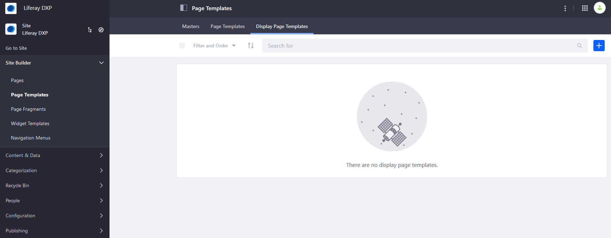
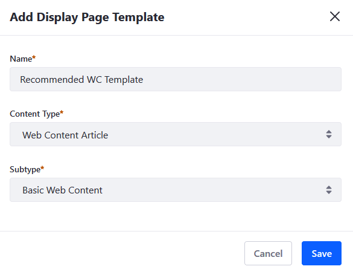
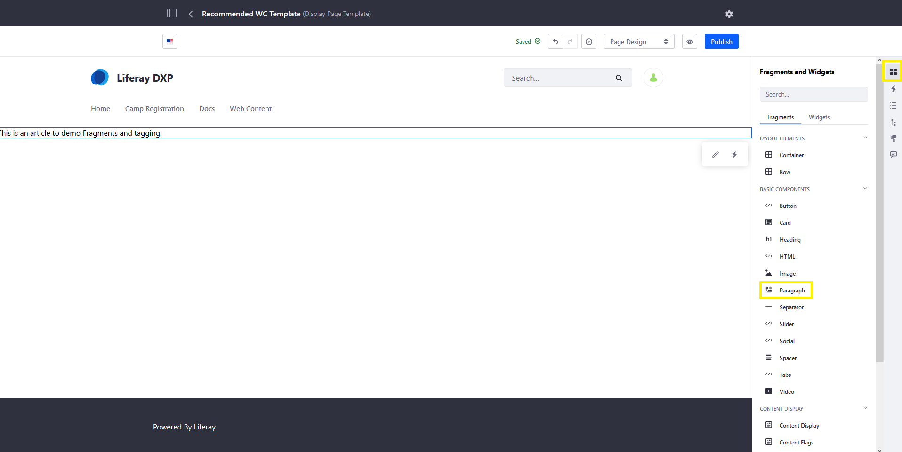
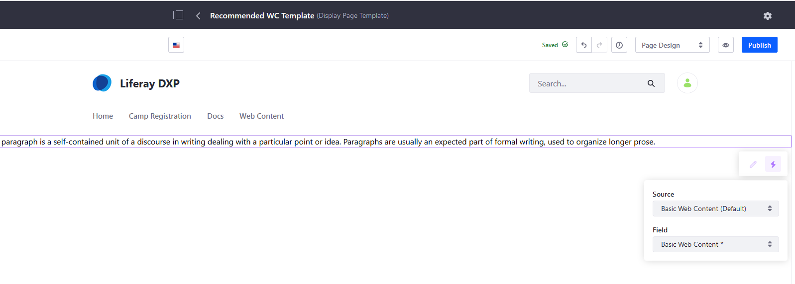
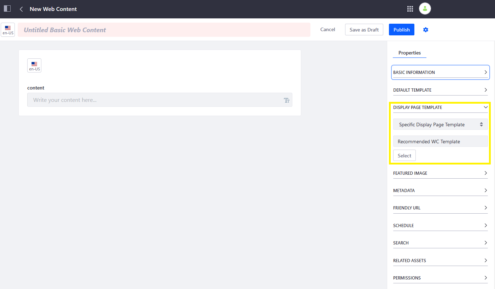
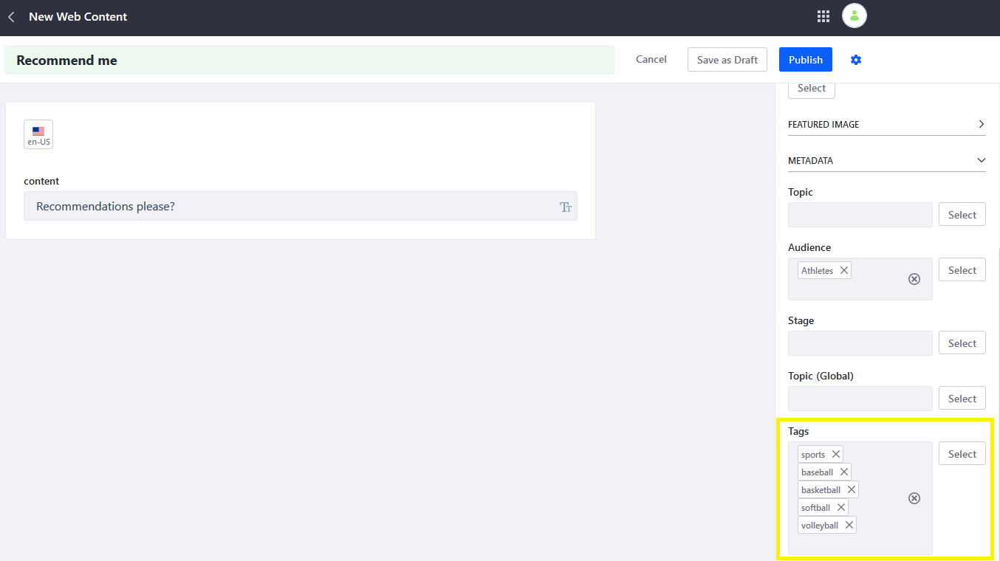
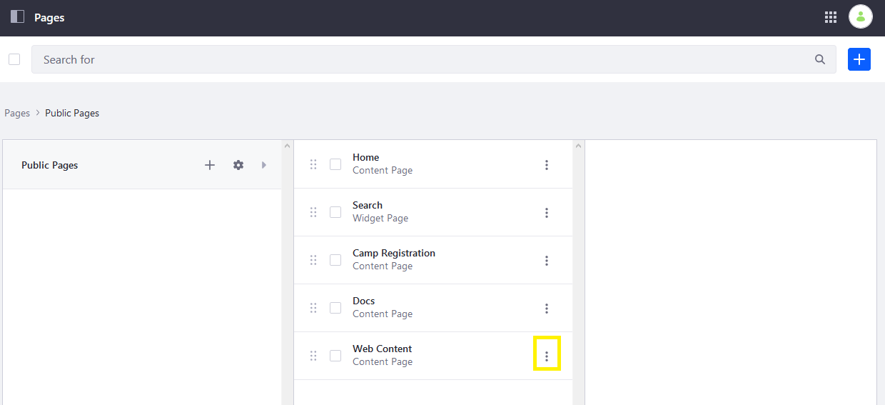
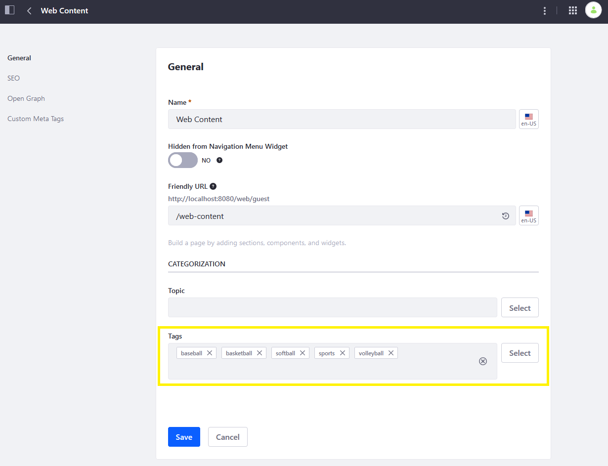
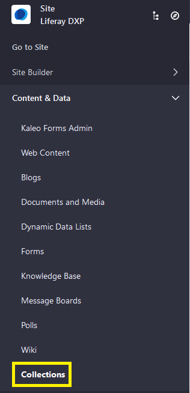
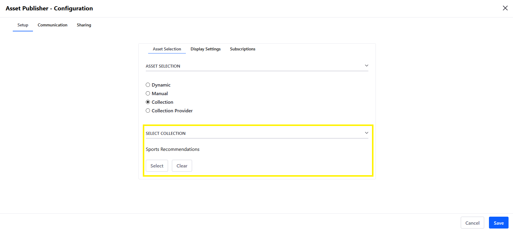

# Content Recommendations

> Subscribers

A site's content generates clicks from users. For example, if someone visits a sporting goods store's site and clicks on several hunting promotional ads, you can deduce an interest in hunting products and can promote this type of content when this user visits the site again. To do this, you need an infrastructure that tracks user views and displays the appropriate content based on behavior. You can accomplish this with _Content Recommendations_. (The alternative is to use Segments but those track perceived audiences and not click behavior.)

This is done by adding tags to content or Site Pages and monitoring visits. When a user views a specific content type or Page, its tags are attached to that user as _interests_. When the user visits other pages, content that matches their interests is displayed to them.

## Monitoring Recommendations

 The monitoring process is facilitated by [Analytics Cloud](../../../../../../analytics-cloud/latest/en/getting-started/quick-tour/welcome-to-analytics-cloud.html), so you must have your DXP instance synced with it. If you haven't done this yet, start by [adding your DXP instance as a data source](../../../../../../analytics-cloud/latest/en/getting-started/connecting-data-sources/connecting-liferay-dxp-using-oauth.html).

Once your DXP instance is synced with Analytics Cloud and you're leveraging Content Recommendations, a user's interests are viewable by navigating to Analytics Cloud's left menu &rarr; *Individuals* &rarr; *Interests*.

See [Individual Profiles](https://learn.liferay.com/analytics-cloud/latest/en/individuals-and-segments/individual-profiles/individual-profiles.html) to learn more about individual analytics.

## Recommending DXP Content

To begin recommending content, you must

* Add tags to content or Pages 
* Display content based on user behavior

### Creating a Display Template to View Recommended Content

To learn how this works, you'll create a _Display Page Template_ to view the web content article: 

1. Navigate to the _Site Administration_ &rarr; _Site Builder_ &rarr; _Page Templates_.

   

1. Click the _Display Page Templates_ tab.
1. Click the _Add_ button ().
1. Enter a name: _Recommended WC Template_.
1. Select _Web Content Article_ content type/
1. Select _Basic Web Content_ for the subtype.

   

1. Click _Save_.

### Configure the Fragment on the Display Page Template

Once the Display Template has been created, you must configure the template by mapping it to the web content article.

1. Click the _Fragments and Widgets_ button.
1. Drag the _Paragraph_ Fragment to the page.

   

1. Click the _Map_ button and select _Basic Web Content_ for its Source and Field.

   

1. Click _Publish_ when finished.

## Creating Content Recommendations Using a Web Content Article

Now that the Display Template has been created, you can create a [web content Article](../../../content-authoring-and-management/web-content/user-guide/web-content-articles/adding-a-basic-web-content-article.md).

1. Navigate to the _Site Adminstration_ &rarr; _Content & Data_ &rarr; _Web Content_.
1. Click the _Add_ button () &rarr; _Basic Web Content_.
1. Enter a name for the article.
1. Enter some content for the article.
1. In the _Properties_ menu on the right, expand the _Display Page Template_ section.

   

1. Select _Specific Display Page Template_ from the dropdown menu.
1. Click _Select_.
1. Click on the desired template: the newly created _Recommended WC Template_.
1. Expand the _Metadata_ section in the right menu.
1. Assign tags that characterize the content. These are the tags that are referenced as interests when a user views the content.

   

1. Click _Publish_ when finished.

Now your web content is mapped to a Display Page, which allows the assigned tags to be tracked as interests when the web content is clicked. You can alter this process based on the asset types you want to recommend.

## Assigning Tag using SEO

You can also assign tags to a Page's SEO configuration; the tags are then assigned to users as interests when they visit the Page.

1. Navigate to _Site Administration_ &rarr; _Site Builder_ &rarr; _Pages_.
1. Click the _Actions_ button () &rarr; _Configure_ for a Page where you're adding tags.

   

1. On the _General_ menu, under _Categorization_, add relevant tags to the page.

   

1. Click _Save_.

Tags have been added to the page and to the web content article. These interests are assessed when recommending content.

## Displaying Content Based on User Behavior

Now that your Site's users' have their interests tracked using tags, create an Asset Publisher to display the content based on their behavior.

1. Navigate to the _Site Administration_ &rarr; _Content & Data_ &rarr; _Collections_.

   

1. Click the _Add_ button () &rarr; _Dynamic Selection_.
1. Enter a name (_Sports Recommendations_.)
1. Click _Save_.

    For more information on Collections, see [Creating Collections](../../../content-authoring-and-management/collections/user_guide.rst).

1. Add an [Asset Publisher](../using-the-asset-publisher-widget/selecting-assets-for-the-asset-publisher.md) widget to a Page.
1. Navigate to its _Options_ () &rarr; _Configuration_ menu.
1. Click the _Collection_ radio button.
1. Expand the _Select Collection_ section and click the _Select_ button.
1. Choose the desired Collection.

   

1. Click _Save_ when finished.
1. Click _Publish_ to apply the changes to the site page.

In a realistic scenario, Content Sets have many assets with differing tags. That way, content similar to a user's interests is displayed over other content.

Now when users have accumulated interests based on views, the Asset Publisher only shows content based on their interests.

## Additional Information

* [Adding a Basic Web Content Article](../../../content-authoring-and-management/web-content/user-guide/web-content-articles/adding-a-basic-web-content-article.md)
* [Selecting Assets for the Asset Publisher](../using-the-asset-publisher-widget/selecting-assets-for-the-asset-publisher.md)
