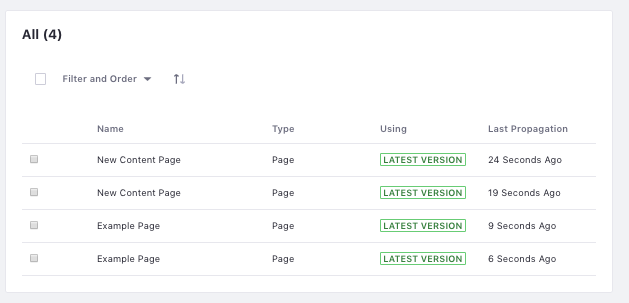
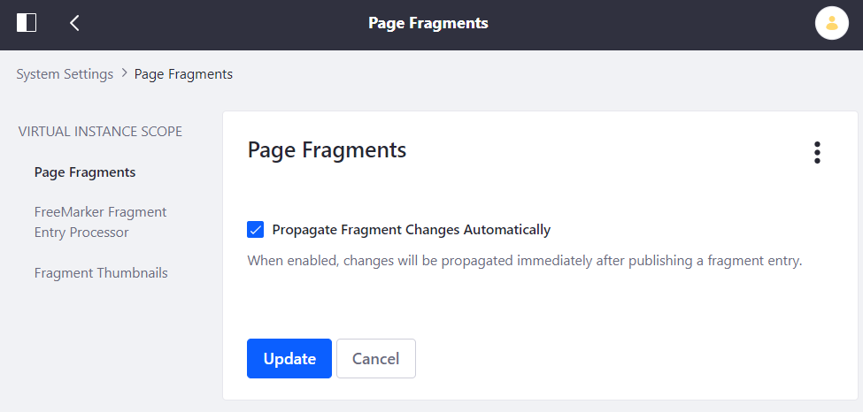

# Propagating Page Fragment Changes

By default, updates made to Page Fragments don't automatically appear on the [Content Pages](../../creating-pages/building-and-managing-content-pages/content-pages-overview.md), [Content Page Templates](../../creating-pages/adding-pages/creating-a-page-template.md), and [Display Pages](./using-display-page-templates/creating-a-display-page-template.md) that use them. You must manually propagate the changes. This ensures that pages aren't automatically updated without page authors knowing about it. However, if you don't have a workflow enabled or you want to test changes during development, you can enable automatic propagation. See [Enabling Automatic Page Fragment Propagation](#enabling-automatic-page-fragment-propagation) for more information.

## Manually Propagating Page Fragment Changes

1. Open the Product Menu and go to Site &rarr; _Site Builder_ &rarr; _Page Fragments_.

1. Select the Collection containing the changed Page Fragment.

1. Open the _Actions_ menu () for the Page Fragment and select _View Usages_.

    ```note::
      You can propagate changes from global Page Fragments to their usages on child Sites. Select *View Site Usages* from the Page Fragment's Actions Menu in the Global Site.
    ```

1. From the _Usages and Propagation_ page, select the Content Page(s), Content Page Template(s), and Display Page(s) where Page Fragment changes should propagate. You can use the various filters and selection options to apply updates to pages quickly.

    

1. Click the _Propagate_ icon () to propagate your changes.

```note::
   Changes to existing ``editable`` fields are not propagated since this overwrites content currently in Content Pages. To force propagation to content in an ``editable`` field, you must change the field ID. Content created in that field no longer appears in the Content Page when the changes are propagated, but it remains in the database and can be retrieved using the old ID.
```

## Enabling Automatic Page Fragment Propagation

> Availability: Liferay DXP 7.2 SP1+ and Liferay Portal CE GA2+

During development testing, manually propagating Page Fragment changes can be tedious. For development purposes, you can enable automatic Page Fragment propagation.

```warning::
   Automatic Page Fragment propagation should only be enabled for development testing, as automatic propagation can lead to unintended consequences in the production environment, such as typos or inaccurate content being published. Automatic propagation only works for HTML, CSS, and JavaScript Page Fragment code, not the editable values.
```

Follow these steps to enable automatic Page Fragment propagation:

1. Open the Product Menu and select _Control Panel_ &rarr; _Configuration_ &rarr; _System Settings_.

1. Click _Page Fragments_ under the Content and Data heading.

1. Enable the _Propagate Fragment Changes Automatically_ setting and click _Save_ to apply the change.



Your Page Fragment updates are now automatically propagated! The Page Fragment Editor displays a notification that automatic Page Fragment propagation is enabled.


