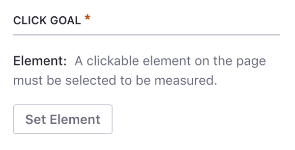
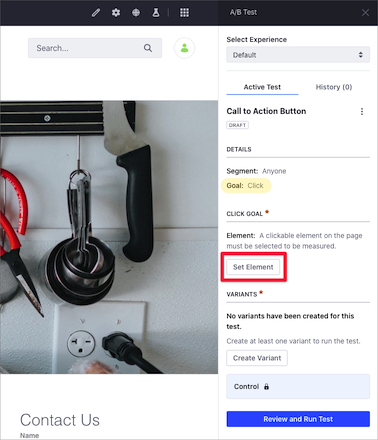

# Creating A/B Tests

1. Go to the Content Page where you want to run the A/B Test.
1. In the Control Menu, click the *A/B Testing* button ().
1. If you have created additional Experiences for the Content Page, select the Experience you want to test.
1. Click *Create Test*.

    ```note::
      To create a test, it must obey the `A/B Tests restrictions <#a-b-test-restrictions>`_.
    ```

1. Enter a *Name* for your test, and optionally add a *Description*.
1. Select the goal you want to track with your test:

   * *Bounce Rate*: Percentage of users who arrive to the page, don't exhibit any activity (like click or scroll), and navigate away from the site without visiting another page
   * *Click*: Percentage of users who clicked on the page (per session)

1. Click *Save* to save the test as a *Draft* (not yet visible to visitors).

    ```note::
      You can always edit or delete the new A/B test by clicking the *Actions* button in the top right of the A/B Test menu. Deleted tests are not recoverable (i.e., not sent to the Recycle Bin). These options are not available for an active running test.
    ```

1. Open the A/B Test sidebar panel for your Content Page.
1. Under the *Active Test* and *Variants* sections, click *Create Variant*.
1. Enter a name for the variant and click *Save*.
1. Click the Edit button () next to the variant's name.

```note::
   Each A/B Test must have at least one variant. create as many test variants as you want. The current Content Page is copied and displayed as the baseline for the variant.
```

1. Edit the variant with the changes you want to test and click *Save Variant* to apply them.
1. If you selected the Click goal, click *Set Element* under the *Click Goal* heading, click the element you want to test on the Content Page, and click the *Set Element as Click Target* button.

    

    ```note::
       Only links and buttons with an ID attribute can be selected as a target for the click goal. The click target element applies to the whole A/B Test, and therefore it must be present in all variants.
    ```

    <!-- Hey Jorge, I replaced the note above with the original text because I'm not sure where you heard that "You can select any clickable element with an ID attribute." Did someone one the team tell you that it can be any clickable element? If so, please add it back. Thanks! -->

    You can edit the target element any time before starting the test.
    
    

1. click *Review and Run Test* to run the test.
1. Optionally, configure test parameters:

    * *Traffic Split*: The percentage of visitors that are randomly split between the Variants when visiting the page. A visitor is randomly assigned to a Variant and always sees the same Variant until the test is finished.
    * *Confidence Level Required*: Represents the accuracy of your test. The higher the required confidence level, the longer it takes to declare the winning Variant.

    

    The *Estimated Time to Declare Winner* provides an estimation of the test duration. This estimation is based on the *Traffic Split* and *Confidence Level Required* configurations, as well as on the estimated page traffic (based on the traffic history provided by Analytics Cloud).

1. Click *Run* and click *OK*.

```note::
  You can cancel a running test at any time using the *Terminate Test* button from the A/B Tests panel. To delete an A/B Test, you must cancel the test first.
```

Liferay DXP only shows your test's status and the winning Variant when the test finishes. You can manage the other aspects of your A/B test, including monitoring, in Analytics Cloud. See [A/B Testing Analytics](https://learn.liferay.com/../../../../ab-testing-analytics.md) for more information.

```note::
    After you create the test, you can always click the *A/B Testing* flask icon on the Content Page to view the test status and history of completed and terminated A/B tests. Since Liferay DXP 7.3, you can also access the A/B Test panel (via the flask icon) and view the test status for an experience through the `experience selection dialog <../experience-personalization/content-page-personalization.md>`_.
```

## A/B Tests Behavior and Restrictions

Consider this information when creating A/B tests:

* You can create a test for a default Experience or a personalized Experience mapped to a Segment.
* When you delete a Content Page or Experience that is part of an A/B test, you also delete the test.
* You can only create an A/B Test for one page or experience at a time.
* You can't create a test for an Experience that already has an active test running.
* You can't edit an Experience that is part of an A/B Test (Liferay DXP 7.3+).
