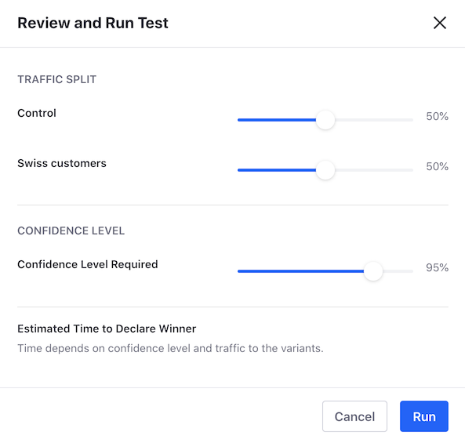

# Running and Monitoring A/B Tests	

You can configure the following parameters when you run the A/B Test:	

- *Traffic Split*: The percentage of visitors randomly split between the Variants when visiting the page. Visitors are randomly assigned to a Variant and always see the same Variant until the test is finished.	
- *Confidence Level Required*: Represents the accuracy of your test. The higher the required confidence level, the longer it takes to declare the winning Variant.	

The *Estimated Time to Declare Winner* provides an estimation of the test duration. This estimation is based on the *Traffic Split* and *Confidence Level Required* configurations, as well as on the estimated page traffic (based on the traffic history provided by Analytics Cloud.)	



## To Run an A/B Test	

1. Go to the Content Page where you want to run the A/B Test.	
1. In the Control Menu, click the *A/B Testing* button ().	
1. If you have created additional Experiences for the Content Page, select the Experience.	
1. Under the *Active Test* section, click *Review and Run Test*.	
1. Optionally, configure the *Traffic Split* and *Confidence Level Required* settings for your test.	
1. Click *Run* and then, click *OK*.	

You can cancel a running test at any time using the *Terminate Test* button. To delete an A/B Test, you must cancel the test first.	

```note::
   After you create the test, you can always click the *A/B Testing* button () on the Content Page to view the test status and history of completed and terminated A/B tests. Since Liferay DXP 7.3, you can also access the A/B Test panel (via the *A/B Testing* button) and view the test status for an experience through the `experience selection dialog <../experience-personalization/content-page-personalization.md>`_.
```

Liferay DXP only shows your test's status and the winning Variant when the test finishes. You can manage the other aspects of your A/B test, including monitoring, in Analytics Cloud. For more information, see [A/B Testing Analytics](../../../../ab-testing-analytics.md).