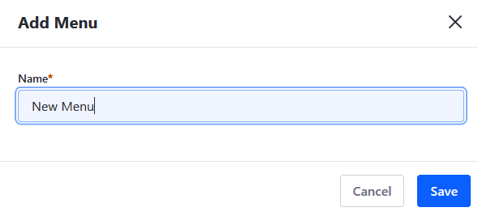
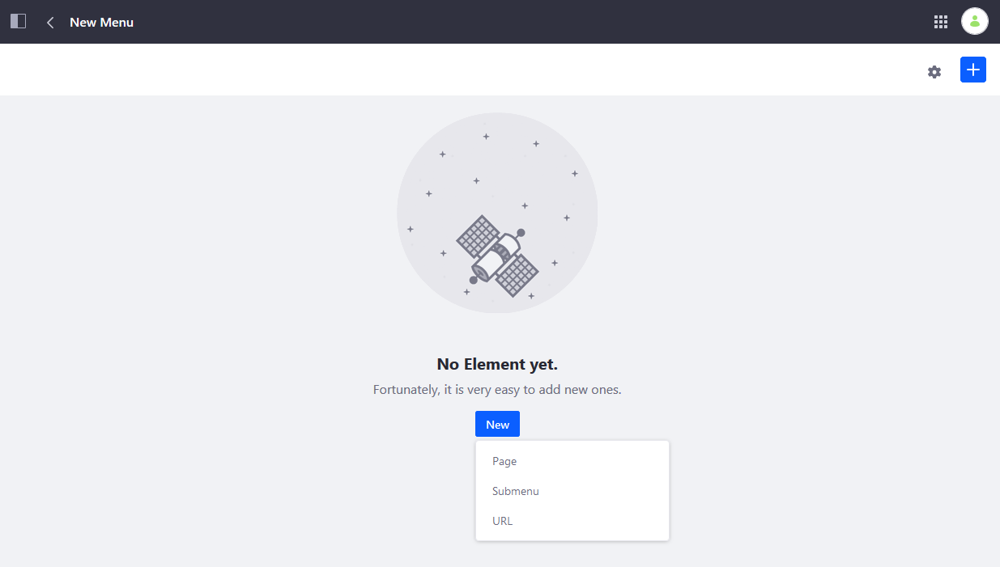
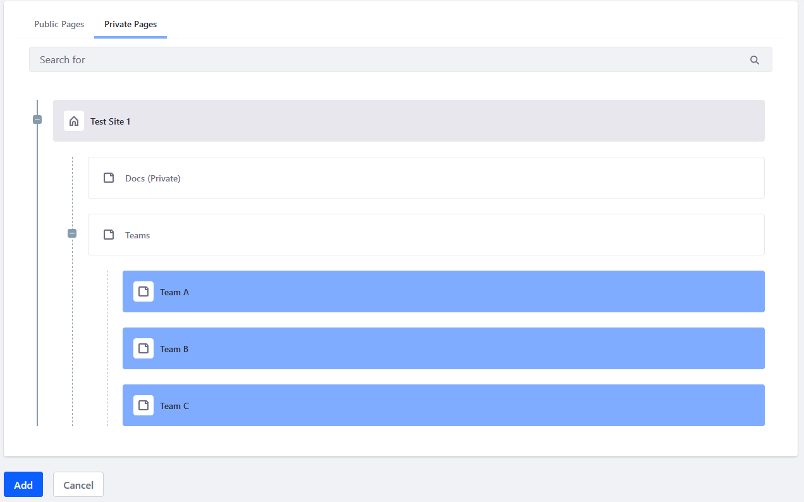
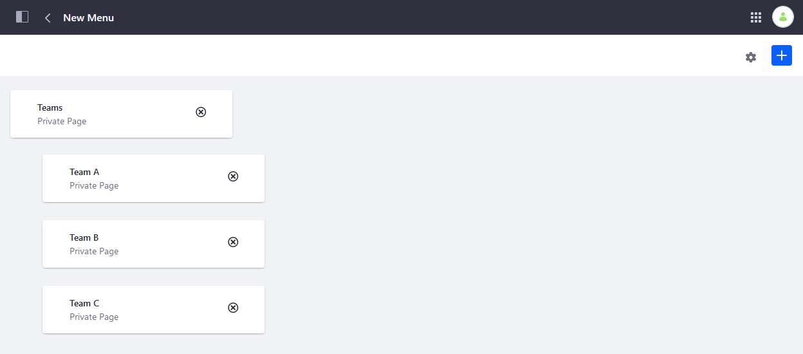
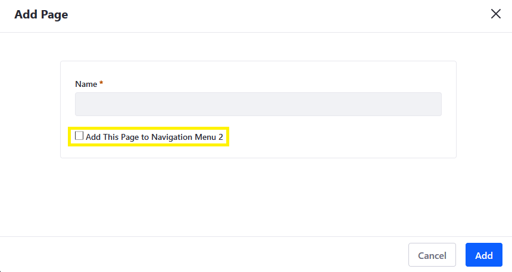
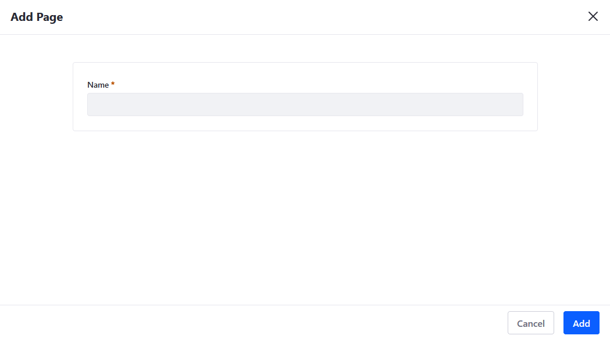
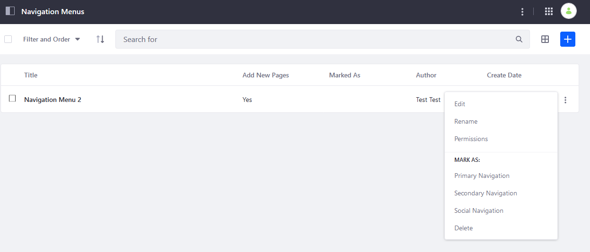

# Using Navigation Menus

Users can create _Navigation Menus_ which groups the desired site pages. For example, users can create a _Navigation Menu_ which contains all the child pages of a given page. They can then add this menu using the _Navigation Menu_ widget to the parent page; that way, site visitors can quickly reach a particular child page.

## Creating Navigation Menus

To create a new _Navigation Menu_:

1. Navigate to your site's _Site Administration_ &rarr; _Site Builder_ &rarr; _Navigation Menus_.
1. Click the _Add_ button () to add a new menu.
1. Enter a name: (for example: _New Menu_).

    

1. Click _Save_ when finished.

The new _Navigation Menu_ has been created.

## Assigning Existing Pages to a Navigation Menu

There are two main ways to assign existing pages to a _Navigation Menu_: click _New_ button or the _Add_ button ().

1. Click _New_ &rarr; _Page_.

    

1. Select the pages to be included into this _Navigation Menu_; in this example, three child pages from the _Private Pages_ are to be included.

    

1. Click _Add_ when finished.
1. Verify that the new Navigation Menu has been created.

    

## Assigning New Pages to a Navigation Menu

Users do not have to [create any site pages](../creating-pages/adding-pages/adding-a-page-to-a-site.md) before creating _Navigation Menus_. Rather, they can create a Navigation Menu first and then assign the pages later. If there are more than one, choose the appropriate menus.

Moreover, by default, new pages can be automatically assigned to a _Navigation Menu_ unless the user deselects it. Users can disable this automatic assignment.

To disable new pages being automatically to a _Navigation Menu_:

1. Click the () icon next to the desired _Navigation Menu_ (for example, _New Menu_) then _Edit_.
1. Click the () icon.
1. Uncheck the box.

    

1. Click _Save_ when finished.

Once disabled, users do not see the prompt to add the page to a _Navigation Menu_.

## Marking a Navigation Menu

Users can mark a Navigation Menu as one of the following:

* *Primary Navigation*
* *Secondary Navigation*
* *Social Navigation*

To mark as Navigation Menu:

1. Click the () icon next to the desired _Navigation Menu_ (for example, _New Menu_)
1. Click the desired navigation (for example, _Primary Navigation_).

    

The Navigation Menu type is displayed in the _Marked As_ field. For more information about each type, see the [Navigation Menu Widget Reference](./navigation-menu-widget-reference.md#navigation-menu).

## Deleting a Navigation Menu

To delete a Navigation Menu:

1. Click the () icon next to the desired _Navigation Menu_ (for example, _New Menu_) then _Delete_.
1. Click _OK_ in the confirmation.

The Navigation Menu has been deleted.

## Additional Information

* [Configuring Site Navigation](./configuring-site-navigation.md)
* [Navigation Menu Widget Reference](./navigation-menu-widget-reference.md)
