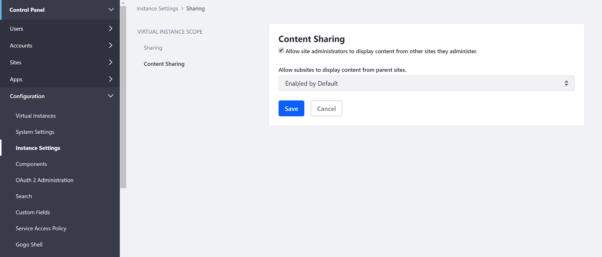

# Managing Content Sharing Across Sites
<!-- What IS content sharing? What does this mean? What is the default setting and what would changing that allow/disallow? -->

You can enable content sharing for a Site through the [configuration settings](../site-settings-ui-reference.md#advanced). You can control this globally as well.

## Configuring Content Sharing

To configure content sharing across sites at the Instance-wide scope, follow these steps:

1. Open the Product Menu and go to *Control Panel* &rarr; *Configuration* &rarr; *Instance Settings*.
1. Select *Sharing* under the Content and Data heading.
1. Click *Content Sharing* under the Virtual instance scope.
1. Enable/disable the *Allow site administrators to display content from other sites they administer* option to choose if Site Administrators can share content between the Sites they administer.
1. Choose if child Sites can display content from parent Sites and configure the defaults. These options are available:

    * **Enabled by Default**: Child Sites can display content from parent Sites by default, but this can be disabled by a Site Administrator.

    * **Disabled by Default**: Child Sites cannot display content from parent Sites by default, but this can be enabled by a Site Administrator.

    * **Disabled**: Child Sites cannot display content from parent Sites, and this behavior cannot be changed by a Site Administrator.

