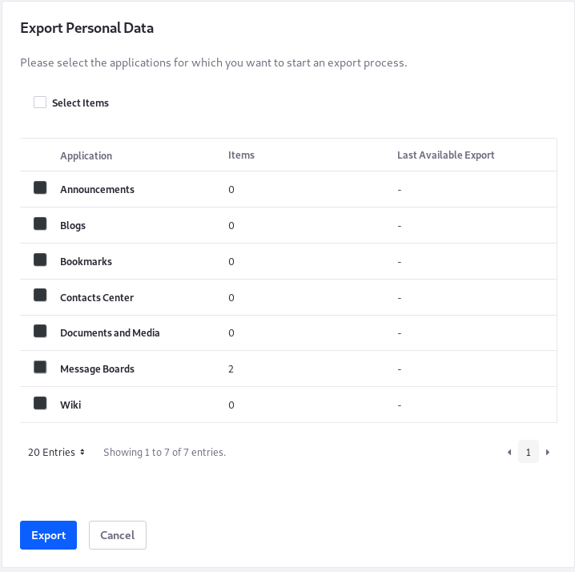
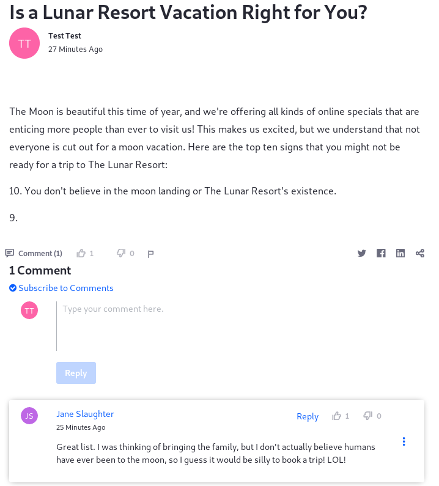

# Exporting User Data

User Management practices must account for the EU's General Data Protection Regulation. One of its tenets is that Users have a right to _data portability_.

Data portability means that a User has the right to receive their personal data in a machine-readable format.

```note::
   Personal data export can help companies in their attempts to satisfy the requirements of GDPR. Using the export tool described here provides no guarantee of compliance with any GDPR requirement. Each company or individual whose website processes user personal data and is under the jurisdiction of GDPR must carefully determine the precise steps necessary to ensure they are fully compliant with GDPR.
```

The Control Panel's User Management system now natively supports the export of a User's personal data to a ZIP file for download. The data format for the files containing the data is XML.

## Exporting and Downloading

To export user data,

1. Go to *Control Panel* &rarr; *Users* &rarr; *Users and Organizations*.

1. Find the User and click the Actions button (), then click *Export Personal Data*.

    This opens the User's Export Personal Data screen.

1. If there are no existing export processes shown, there's only one thing to do: click the *Add* button (). The tool for exporting the User's data appears.

    

1. Most of the time you want to export all the available data. Click *Select Items*, and all applications containing User data are selected in the UI.

1. Click *Export*. You're taken back to the User's Export Personal Data screen, but now there's an export process in the list.

    

1. Download the data. Click the Actions button () for the process and select *Download*.

## Examining Exported Data

So what does the exported data look like?

```xml
<?xml version="1.0"?>

<model>
    <model-name>com.liferay.message.boards.model.MBMessage</model-name>
    <column>
        <column-name>messageId</column-name>
        <column-value><![CDATA[38099]]></column-value>
    </column>
    <column>
        <column-name>statusByUserId</column-name>
        <column-value><![CDATA[38045]]></column-value>
    </column>
    <column>
        <column-name>statusByUserName</column-name>
        <column-value><![CDATA[Jane Slaughter]]></column-value>
    </column>
    <column>
        <column-name>userId</column-name>
        <column-value><![CDATA[38045]]></column-value>
    </column>
    <column>
        <column-name>userName</column-name>
        <column-value><![CDATA[Jane Slaughter]]></column-value>
    </column>
    <column>
        <column-name>subject</column-name>
        <column-value><![CDATA[Great list. I was thinking of bringing the family,...]]></column-value>
    </column>
    <column>
        <column-name>body</column-name>
        <column-value><![CDATA[<p>Great list. I was thinking of bringing the family, but I don&#39;t
  actually believe humans have ever been to the moon, so I guess it
  would be silly to book a trip! LOL!</p>]]></column-value>
    </column>
</model>
```

In this example, User Jane Slaughter made a Message Boards Message post, and her User information was recorded in the `MBMessage` model's database table.

This actually corresponds with a comment on a Blogs Entry:



Exporting User data informs Site owners and Users about how much personal data the sight may have.
