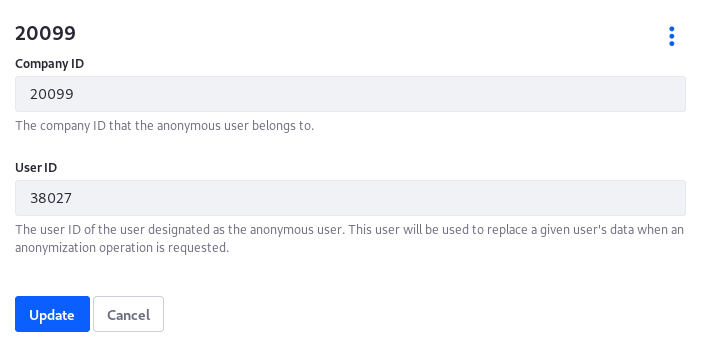

# Managing User Data

Internet users are increasingly and justifiably concerned about how their personal data is processed by the systems they use. The enforcement of GDPR is a crystallization of these concerns into legislative action. Companies processing the personal data of EU residents must adopt appropriate measures to protect User data. Of course, legal requirements like those in GDPR only explain one reason for companies to develop policies for ensuring their users' right to privacy. The market demands site owners show higher levels of responsiveness to User inquiries into how their data is stored and processed.

Liferay is aware of the need for functionality to address User data management, and added two important features toward this end:

[Erase and/or anonymize data associated with a User](/docs/7-2/user/-/knowledge_base/u/sanitizing-user-data)
: Administrative Users go through a step by step process, choosing to erase certain pieces of data and anonymize others.

[Export a User's personal data](/docs/7-2/user/-/knowledge_base/u/exporting-user-data)
: Export ZIP files containing the data associated with a User.

These features are tools that get you closer to meeting two of GDPR's technically challenging requirements, the _right to data portability_ and the _right to be forgotten_.

```note::
   It is Liferay's sincerest hope that through the User Management functionality of Liferay DXP, companies processing the personal data of their website's users can satisfy the requirements of GDPR. However, the tools discussed here and anywhere else in the documentation, including those directly aimed at addressing GDPR requirements (as in this article) do not guarantee compliance with the legal requirements of GDPR. Each company or individual whose website processes user personal data and is under the jurisdiction of GDPR must carefully determine the precise steps necessary to ensure they are fully compliant with GDPR.
```

## Anonymizing Data

Deleting User data is the safest way to honor _right to be forgotten_ requests. When User data must be preserved, automatic anonymization of the data is in order. Users being anonymized must have their identifiers (for example, User ID and User Name) removed from content they've interacted with. However, portal content usually requires this information for its applications to work properly. Therefore, the User's identifiers must be replaced by something, or someone. Meet the new User, *Anonymous Anonymous*, identity swapper *extraordinaire*. This deactivated User is dedicated to be the User whose identifiers are assigned to anonymized content. This identity swap is an important step in the anonymization process, but additional manual intervention may be necessary to truly achieve anonymization.


Here at Liferay, we've grown fond of *Anonymous Anonymous*. If you'd rather start from scratch or assign an existing User to be the Anonymous User, get rid of *Anonymous Anonymous* and configure your own Anonymous User.

The anonymous user is programmatically created for each instance the first time an Administrator clicks *Delete Personal Data* from a User's Actions menu (). If you haven't yet done that, no Anonymous User exists.

The easiest way to set up a new User as the Anonymous User is to edit an existing Anonymous User configuration, passing in the new Anonymous User's User ID. 

To edit an existing configuration:

1. Go to Control Panel &rarr; Configuration &rarr; System Settings &rarr; Users &rarr; Anonymous User.

1. Edit the existing configuration, providing a different User ID.

    Get the User ID from Control Panel &rarr; Users &rarr; Users and Organizations. Click on the User and find the User ID in the Information screen of the Edit User application.

1. Click *Update*.

To create a new Anonymous User:

1. [Create a User](/docs/7-2/user/-/knowledge_base/u/adding-editing-and-deleting-users#adding-users) use for data anonymization. Alternatively, you can use an existing User.

1. If there's already an Anonymous User configured for the instance, there are two ways to remove it: 
 
    Delete the User entirely. Deleting the User simultaneously deletes its configuration as the Anonymous User. Go to Control Panel &rarr; Users &rarr; Users and Organizations. If it's an active User, first deactivate, then delete the User. The default Anonymous Anonymous User is deactivated by default. Simply delete the User in this case. Click the Actions button () and select *Delete*.

    If you don't want to delete the User, just delete the User's configuration as the Anonymous User. Go to Control Panel &rarr; Configuration &rarr; System Settings &rarr; Users &rarr; Anonymous Users.

1. Add a new Anonymous User configuration. Click the *Add* button.

1. Fill out the two fields, Company ID and User ID. 

    Get the Company ID from Control Panel &rarr; Configuration &rarr; Virtual Instances. The Instance ID and Company ID are the same.

    Get the User ID from Control Panel &rarr; Users &rarr; Users and Organizations. Click on the User and find the User ID in the Information screen of the Edit User application.

There can only be one Anonymous User configured for each instance.



## Manual Anonymization

Anonymizing just the User's identification fields is often not enough. If a User named Ziltoid Omniscient complains about The Lunar Resort's coffee in a Message Boards Message and in it signs the post with _Supreme Leader of Ziltoidea 9_, anonymizing this post would remove the User's name (Ziltoid Omnisicent) and replace it with Anonymous Anonymous, but searching the Internet for _Ziltoidea
1. quickly reveals that the post was written by 
[Ziltoid the Omniscient](https://en.wikipedia.org/wiki/Ziltoid_the_Omniscient). There can be user-entered personal data within the content of an application. You must manually edit such content to remove identifying details. 


