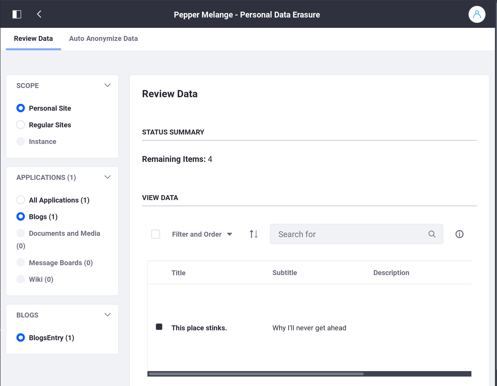
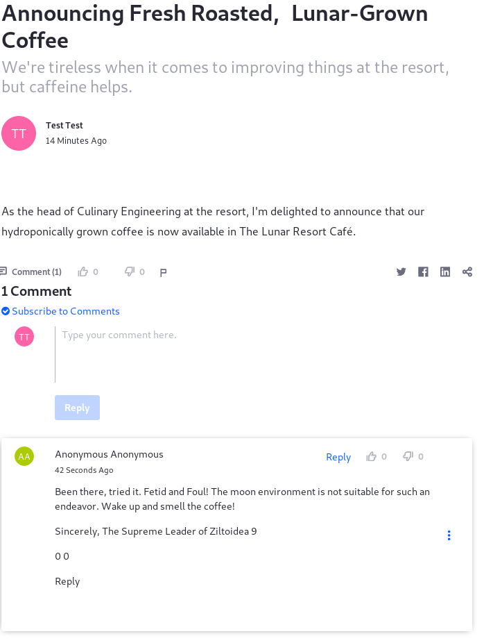

# Sanitizing User Data

One of the technically challenging requirements of the General Data Protection Regulation (GDPR) is _the right to be forgotten_. The purpose here is not to go into the details of this requirement, but to show two pieces of functionality that can assist you in satisfying the requirement: Personal Data Erasure and Data Anonymization.

Being _forgotten_ by software is removing the ability for even administrators to glean information that could lead to knowing the identity of the User whose personal data was erased or anonymized.

Conceptually, forgetting a User means two things, at a minimum:

* Erasing the User's identifying information from the system. In Liferay DXP, this entails removing the User from database tables and search indexes.
* Erasing or anonymizing content the User has interacted with so it cannot be tracked to a real person.

``` tip::
   `Isn't User deactivation and deletion enough?`

   Deleting removes the User from the table of Users in the database. The User's information, however, is preserved in other locations. In a standard User deletion scenario, all of a User's personally created content is still assigned to the User by the system's identifiers (User ID and User Name) and still appears in the UI next to the content. This unintentional preservation of user-identifying data is inadequate for satisfying some of the GDPR requirements and is the primary reason why the data erasure functionality was added.
```

## The Personal Data Erasure Screen

User data deletion and anonymization both happen in the same place: the Personal Data Erasure screen:

1. Open the Applications Menu () and go to Control Panel &rarr; Users &rarr; Users and Organizations.

1. Click the Actions button for a User () and select *Delete Personal Data*.

   > If you have not deactivated the user, you are asked to do so.

   The User's Personal Data Erasure screen appears.

You can browse all data the User has posted on the system. Click *Personal Site* to browse data from that Site.



Click *Regular Sites* to browse any data posted in regular Liferay Sites.


To review the User's data, click the item. For example, Pepper seems to have posted a blog entry on her personal Site. Clicking that entry reveals the title of that blog entry.


To review any entry, click it. You're brought to the application's edit mode (in this case, Blogs), where you can make any changes to the content that are necessary. 

To manage (anonymize or delete) all the items for an application at once: 

1. Click the Actions button () for the application.

1. If you're sure all items for an application can be safely deleted, choose *Delete*. 

1. If you're sure simple anonymization is good enough for all of an application's items, choose *Anonymize*.

Use the interface to browse through the Sites, applications, and data. 

## Delete the User

Once all data is reviewed, deleted, edited, and/or anonymized as appropriate, delete the User. A dialog box pops up automatically when you're finished in the Personal Data Erasure screen. This step is simple: Click *OK*.


Now the User's data is anonymized or deleted, and the User is also deleted.


## Manual Anonymization

Anonymizing just the User's identification fields and deleting the User is often not enough. If a User named Ziltoid Omniscient complains about The Lunar Resort's coffee in a Message Boards Message and in it signs the post with _Supreme Leader of Ziltoidea 9_, anonymizing this post would remove the User's name (Ziltoid Omnisicent) and replace it with Anonymous Anonymous, but searching the Internet for _Ziltoidea_ quickly reveals that the post was written by [Ziltoid the Omniscient](https://en.wikipedia.org/wiki/Ziltoid_the_Omniscient). Because there can be user-entered personal data within the content of an application, you must manually edit such content to remove identifying details. 



