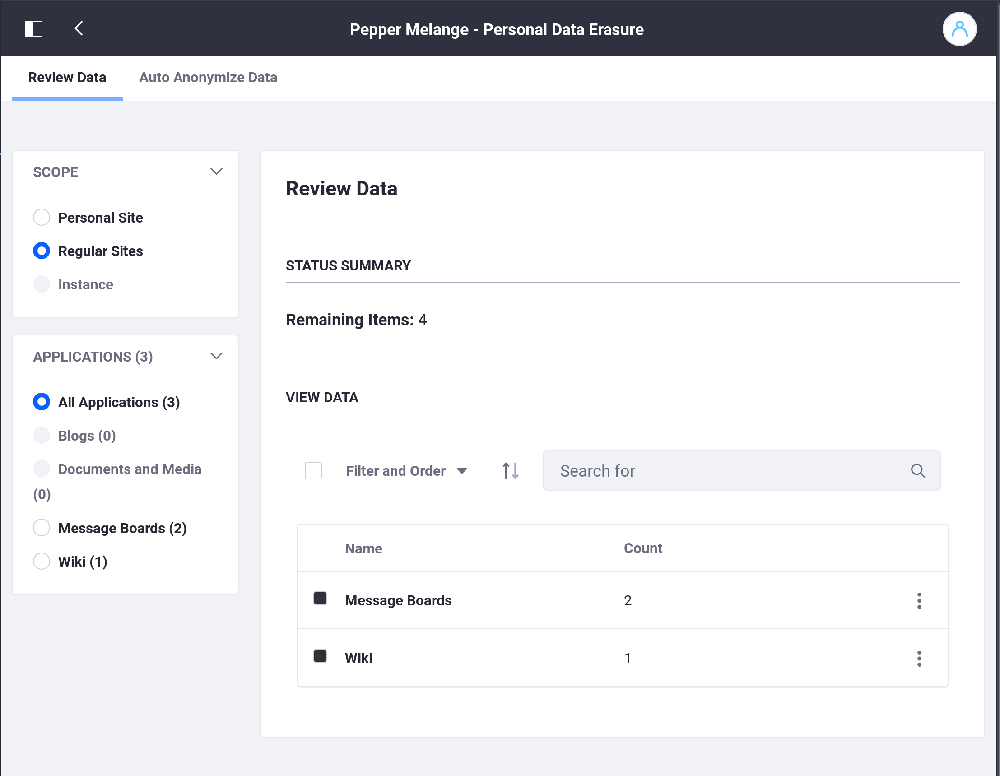

# Sanitizing User Data

One of the technically challenging requirements of the General Data Protection Regulation (GDPR) is _the right to be forgotten_. The purpose of this article is not to go into the details of this requirement, but to show you two pieces of functionality that can assist you in satisfying the requirement:

- Personal Data Erasure 
- Data Anonymization

A simple way to think of what it means to be _forgotten_ by software is to consider a scenario where a new portal administrator is hired immediately after a User's right to be forgotten request has been honored. The new portal administrator has access to all of the Site's content and administration capabilities. Despite this, the administrator must not be able to glean information that could lead her to knowing the identity of the User whose personal data was erased.

Conceptually, forgetting a User means two things, at a minimum:

* Erasing the User's identifying information from the system. In Liferay DXP, this  entails removing the User from database tables and search indexes.
* Erasing or anonymizing content the User has interacted with so it cannot be tracked to a real person.

_Isn't User deactivation and deletion enough?_
Deleting removes the User from the table of Users in the database. The User's information is preserved in other locations, however. In a standard User deletion scenario, all of a User's personally created content is still assigned to the User by the system's identifiers (User ID and User Name) and still appears in the UI next to the content. This unintentional preservation of user-identifying data is inadequate for satisfying some of the GDPR requirements and is the primary reason why the data erasure functionality was added.

```note::
   Personal data erasure can help companies in their attempts to satisfy the requirements of GDPR. Using the data erasure tool described here provides no guarantee of compliance with the legal requirements of GDPR. Each company or individual whose website processes user personal data and is under the jurisdiction of GDPR must carefully determine the precise steps necessary to ensure they are fully compliant with GDPR.
```

Whether deleting or anonymizing, to begin sanitizing a User's data,

1. Open the Applications Menu () and go to Control Panel &rarr; Users &rarr; Users and Organizations.

1. Click the Actions button for a User () and select *Delete Personal Data*.

   > If you have not deactivated the user, you will be asked to do so.

   The User's Personal Data Erasure screen appears.

## The Personal Data Erasure Screen

You can browse all data the user has posted on the system. Click *Personal Site* to browse data from that site.


Click *Regular Sites* to browse any data posted in regular Liferay sites.



To review the user's data, click the item. For example, Pepper seems to have posted a blog entry on her personal Site. Clicking that entry reveals the title of that blog entry.


To review any entry, click it. You're brought to the edit mode of the application (in this case, Blogs), where you can make any changes to the content that are necessary. 

To manage (anonymize or delete) all the items for an application at once: 

1. Click the Actions button () for the application.

1. If you're sure all items for an application can be safely deleted, choose *Delete*. 

1. If you're sure simple anonymization is good enough for all of an application's items, choose *Anonymize*.

Use the interface to browse through the Sites, applications, and data. 

## Delete the User

Once all data is reviewed, deleted, edited, and/or anonymized as appropriate, delete the User. A dialog box pops up automatically when you're finished. This step is simple: Click *OK*.


Now the User's data is anonymized or deleted, and the User is also deleted.
