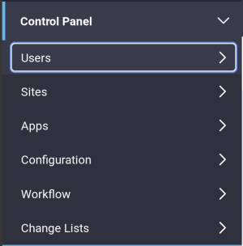

# Users and Organizations

*Users* and *Organizations* are foundational elements in Liferay DXP. Users represent people who sign in and perform various tasks. Organizations collect Users into hierarchical structures, making it easier for you to manage them in these collections. 

Go to the Control Panel's *Users and Organizations* section to manage Users and Organizations. 

These are just a few examples of activities executed from the Users and Organizations section of the Control Panel: 

- An employee leaves the company, requiring account deletion

- An employee joins the company and must be added to a specific department in the portal. 

- An employee is promoted to a new role and needs additional permissions to perform responsibilities. 

- The company creates a new department. You add this new department as an Organizations and give the department's employees their own internal website.

- An employee gets married and changes her name.

## What are Users?

A User is an entity that can sign into Liferay DXP and do something. A User has more privileges, called Permissions, than a Guest who does not sign in. Users are assigned Roles, and Roles define the User's permissions.

## What are Organizations? 

An *Organization* groups [*Users*](./adding-and-managing-users.md) hierarchically. For example, you can model a company's departments (i.e., Human Resources and Customer Support) with Organizations. Organizations often have their own Sites. 

The main purpose of Organizations is to enable distributed User management. Portal administrators can delegate some User management responsibilities to Organization administrators. If you don't anticipate needing to delegate User management responsibilities, your portal design may not need Organizations. In fact, many portal designs don't use Organizations at all; they only use Sites. 

**User Groups and Organizations:** It's easy to confuse User Groups with Organizations since they both collect Users. User Groups are ad hoc collections of Users, organized for a specific function. If you wanted a group of bloggers, for example, it wouldn't make sense to assign the Sales Organization the Role of blogging, since you might need a business blog, an IT blog, or a Marketing blog. Instead, a User Group containing one individual from each Organization who is responsible for blogging would make more sense. 

To decide whether your portal design should include Organizations, think about its function. Organizations are useful for corporations, educational institutions, governments, or any other large entity since their Users can be placed into a hierarchical structure. 

But Organizations aren't only for large enterprises. Any group hierarchy, from large government agencies down to small clubs, can be modeled with Organizations. Also, don't think that you must decide between an Organization-based structure or a Site-based structure for assembling your portal's Users. Users can belong both to Organizations and to independent Sites. For example, a corporation or educational institution could create a social networking site open to all Users, even ones from separate Organizations. 

Users and Organizations are two of the most common ways to administer Liferay DXP and model your use case. Read on to learn how to manage them. 
