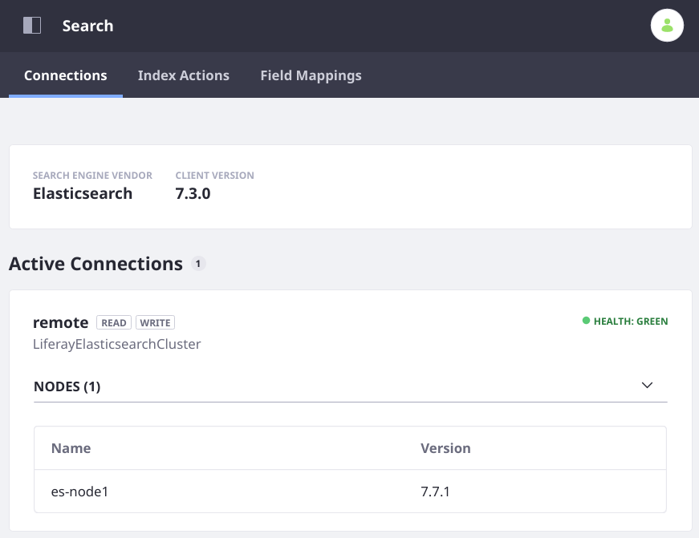

## Connecting to Elasticsearch

TODO: Add Security

These instructions differ if you're using the REST-based Elasticsearch Client that's bundled with Liferay CE/DXP 7.3, or the client backed by the Java Transport Client available on Liferay Marketplace for Liferay CE/DXP 7.2. Differentiation between the installation procedure is noted. 

Stop each Liferay DXP server node before completing these steps.

```important:: 
   The connectors for 7.2 and 7.3 are different: 7.3 is bundled with a connector application that uses the `High-Level Rest Client <https://www.elastic.co/guide/en/elasticsearch/client/java-rest/7.x/java-rest-high.html>`__ from Elastic, while the 7.2 Elasticsearch connector uses the `Transport Client <https://www.elastic.co/guide/en/elasticsearch/client/java-api/7.x/transport-client.html>`__. Configurations for both connectors are presented here.
```

Redundant note above

### Liferay DXP/CE 7.2: Install the Liferay Connector to Elasticsearch 7

On Liferay DXP 7.2, the bundled connector application and APIs are for Elasticsearch 6 and must be disabled to install the connector for Elasticsearch 7. Create a file called

```
com.liferay.portal.bundle.blacklist.internal.BundleBlacklistConfiguration.config
```

Give it these contents:

```properties
blacklistBundleSymbolicNames=[ \
	"com.liferay.portal.search.elasticsearch6.api", \
	"com.liferay.portal.search.elasticsearch6.impl", \
	"com.liferay.portal.search.elasticsearch6.spi", \
	"com.liferay.portal.search.elasticsearch6.xpack.security.impl", \
	"Liferay Connector to X-Pack Security [Elastic Stack 6.x] - Impl" \
]
```

Place it in `[Liferay Home]/osgi/configs`. When Liferay DXP is started (not yet) this file is read and the bundles declared will not be started.

```tip::
   **Docker:** `Liferay Home` and other important folders of a Liferay DXP installation are accessed in a Docker container at `/mnt/liferay` as described `here <../../../installation-and-upgrades/installing-liferay/using-liferay-dxp-docker-images/dxp-container-lifecycle-and-api.md#api>`__. You can use ``docker cp /path/to/local/file [container_name]:/mnt/liferay/files/osgi/configs`` to place configuration files into the container. A similar command can be used to deploy the Liferay Connector to Elasticsearch 7 LPKG file.
```

With Liferay DXP 7.3, the latest Liferay Connector to Elasticsearch 7 is bundled. If you're running Liferay DXP 7.2 SP1+, you can download and install the latest connector application from Marketplace, which includes Elasticsearch 7 APIs corresponding to the ones you uninstalled for Elasticsearch 6.

1. Download the Liferay Connector to Elasticsearch 7.

   Make sure the connector you download corresponds to your Elasticsearch version. Note that the client libraries in the connector can be for an older version of Elasticsearch (e.g., 7.3) even though the Connector application supports a newer version (e.g., 7.7.1). Testing is done with the connector when a new minor version of Elasticsearch is released to ensure no updates to the client are required. As always, consult the [Compatibility Matrix](https://help.liferay.com/hc/sections/360002103292-Compatibility-Matrix).

   - CE: [Liferay CE Connector to Elasticsearch](https://web.liferay.com/en/marketplace/-/mp/application/170642090)
   - DXP: [Liferay Connector to Elasticsearch](https://web.liferay.com/en/marketplace/-/mp/application/170390307)

1. [Install the LPKG](../../../system-administration/installing-and-managing-apps/installing-apps/installing-apps.md) by placing it in the folder

   ```bash
   [Liferay Home]/deploy
   ```

   If you're using a Liferay DXP Docker container, there's [more than one way](../../../installation-and-upgrades/installing-liferay/using-liferay-dxp-docker-images/providing-files-to-the-container.md) to get the LPKG into the container. This `docker cp` command represents one way:

   ```bash
   docker cp ~/path/to/Liferay\ Connector\ to\ Elasticsearch.lpkg [container]:/mnt/liferay/deploy
   ```

   When you start the server (not yet) the LPKG is processed and deployed.

Now the connector must be configured to connect to the remote Elasticsearch 7 node(s).

### Configuring the Connector

The Elasticsearch 7 connector is configured via a configuration file named

```bash
com.liferay.portal.search.elasticsearch7.configuration.ElasticsearchConfiguration.config
```

Place the `.config` file into `[Liferay Home]/osgi/configs/`.

If you're using a Liferay DXP Docker container, you can use `docker cp`: 

```bash
docker cp ~/path/to/com.liferay.portal.search.elasticsearch7.configuration.ElasticsearchConfiguration.config [container]:/mnt/liferay/files
```

Alternatively, make the same configurations from the user interface: in the Applications Menu (), go to Control Panel &rarr; System Settings and open the _Search_ category. The entry is called Elasticsearch 7.

> Liferay CE/DXP 7.2: The Control Panel is in the Product Menu ().

#### Configuring the Connector for 7.3

A simple configuration of the 7.3 connector enables production mode, sets the URL to each Elasticsearch node in the network host addresses property, and identifies the connection you're configuring. The properties in the configuration file might look like this:

```properties
productionModeEnabled="true"
networkHostAddresses=["http://es-node1:9200","http://es-node3:9200","http://es-node3:9200"]
remoteClusterConnectionId="remote"
# Highly recommended for all non-prodcution usage (e.g., practice, tests, diagnostics):
#logExceptionsOnly="false"
```

Using a Remote Cluster Connection Id value different than "remote" will require you to add a connection via the `ElasticsearchConnectionsConfiguration` entry.

```tip::
  The network host address format is ``http[s]://[hostname]:[port]``. If using a Docker container, the hostname was mapped to the Elasticsearch container's IP address, declared in the DXP container's ``/etc/hosts`` file. Sometimes this is done as part of the DXP container's ``docker run ...`` command, using the ``--add-host`` option. The port was defined in the Elasticsearch container's docker run command as the first value of the ``-p 1234:5678`` option (it's ``1234`` in that case). If running a local test environment without HTTPS enabled, all the addresses can be ``http://localhost:port``.
```

<!-- obsolete?
1. Create a configuration file to turn on REMOTE mode and point at your newly configured connection: 

   ```bash
   [Liferay Home]/osgi/configs/com.liferay.portal.search.elasticsearch7.configuration.ElasticsearchConfiguration.config
   ```

   Declared the operation mode and the connection ID to use:

   ```properties
   operationMode="REMOTE"
   remoteClusterConnectionId="remote"
   ```
-->

<!--
   default to security https:// 
   link to reference docs when written
-->

#### Configuring the Connector for 7.2

A simple configuration of the 7.2 connector enables REMOTE operation mode, sets the transport address for each Elasticsearch node, and identifies the connection you're configuring:

```properties
operationMode="REMOTE"
transportAddresses="ip.of.elasticsearch.node:9300"
# Highly recommended for all non-prodcution usage (e.g., practice, tests, diagnostics):
#logExceptionsOnly="false"
```

#### Checkpoint: Start Liferay CE/DXP and Re-Index

Start Liferay CE/DXP. Once it's running, verify that the Elasticsearch connection is active in Control Panel &rarr; Configuration &rarr; Search.



Reindex your search and spell check indexes. Both reindex actions are carried out from the Index Actions tab of Control Panel &rarr; Configuration &rarr; Search.

Now the configuring and searching fun can really begin.

## Related Topics

[Liferay Enterprise Search](../../liferay_enterprise_search.rst)
[Search Pages](../../search-pages-and-widgets/working-with-search-pages/search-pages.md)
[Administering and Tuning Search](../../search_administration_and_tuning.rst)
[Search Configuration Reference Guide](../../search-configuration-reference.md)

