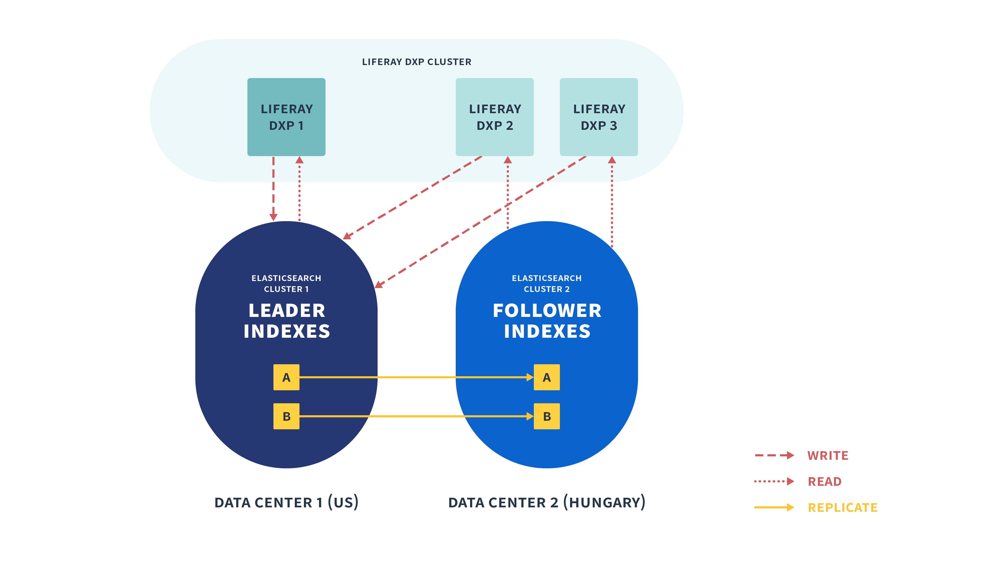
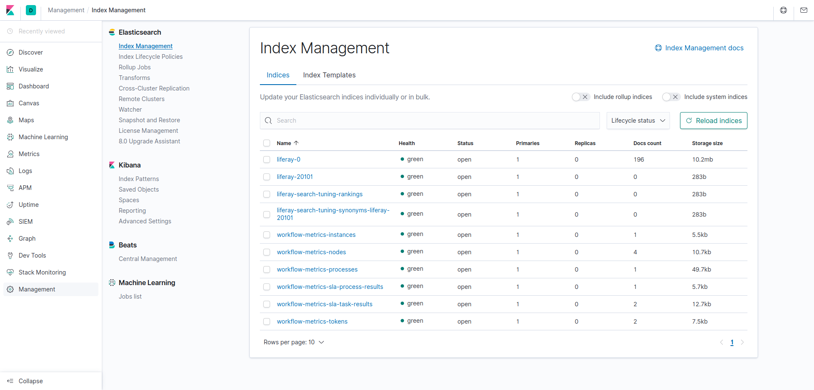
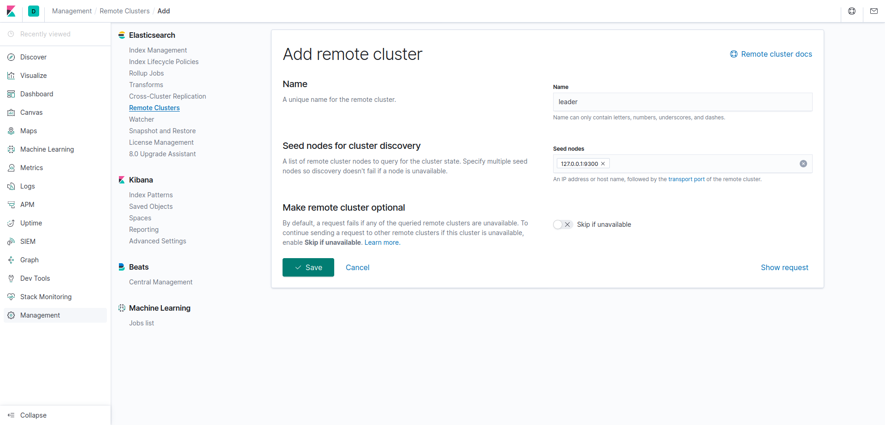

# Configuring Cross-Cluster Replication

> **Liferay Enterprise Search (LES) Subscribers**

Configure Liferay DXP's Cross-Cluster Replication module and Elasticsearch to set up a read-write connection from one Elasticsearch server to one Liferay DXP cluster node, and a read connection from another Elasticsearch server to a second Liferay DXP cluster node:

```important::
   To use CCR, all of your DXP cluster nodes must be running Liferay DXP 7.2 Fix Pack 5+ / Service Pack 2+.
```



This represents the simplest scenario you can configure to reap the data locality and disaster recovery benefits of Cross-Cluster Replication.

The Elasticsearch API calls are provided in a format that allows you to  copy and paste them directly into Kibana's Dev Tools console, which can be accessed via a separate Kibana installation or through the [X-Pack Monitoring widget](./monitoring-elasticsearch.md).

```note::
   To use Kibana, remember that you have multiple Elasticsearch clusters (two single-node clusters in this example) running. The `elasticsearch.hosts: [ "http://localhost:<port>" ]` setting in Kibana's `kibana.yml` file must point to the correct port when managing the indexes and other configurations described below to avoid mixing the leader and the follower clusters. In this article, we assume that your leader Elasticserach cluster node is configured to use `9200` while the follower node is using `9201` as HTTP port.
```

<!-- From Tibor: Highlight that the guide is super-simplified and deals with setting up a 1-1 node ES clusters (leader and follower) running on localhost. A prod-ready environment needs different settings.-->
<!-- From Russ: We should just adapt to those settings instead of saying "this guide shows steps that you can't follow for a real setup." I think we need to elevate our docs game for CCR. -->

## Prerequisite for Elasticsearch 6: Enable Soft Deletes

[Soft deletes](https://www.elastic.co/guide/en/elasticsearch/reference/6.7/ccr-requirements.html) must be enabled for all existing indexes. This is not done by default on Elasticsearch 6. Before proceeding, read [here](./configuring-ccr-enabling-soft-deletes-on-elasticsearch-6.md) to configure soft deletes on your Elasticsearch 6 indexes, then resume reading here to set up CCR.

If Elasticsearch 6 is not a hard requirement for your system, you should upgrade to Elasticsearch 7 before configuring CCR. 

## Prerequisite for Elasticsearch 7: Install the Liferay Connector to Elasticsearch 7

If you are using Elasticsearch 7, you have to install the [Elasticsearch 7 connector](https://web.liferay.com/marketplace/-/mp/application/170390307) from Marketplace **version `3.0.1+`** (requires DXP 7.2 FP5+/SP2+) on all DXP cluster nodes. Read [Upgrading to Elasticsearch 7](https://help.liferay.com/hc/en-us/articles/360035444872-Upgrading-to-Elasticsearch-7) for details.

## Install the Cross-Cluster Replication Module

1. Download the Liferay DXP Cross-Cluster Replication for Elasticsearch LPKG from the [LES downloads page](https://customer.liferay.com/downloads).

1. [Install the LPKG](../../system-administration/installing-and-managing-apps/installing-apps/installing-apps.md) into the local Liferay DXP instance.

## Configure the Elasticsearch Clusters

This example uses two single-node Elasticsearch clusters on `localhost`, each with a copy of the same indexes.

A vanilla Liferay DXP 7.2 installation contains the indexes presented in the introductory [Cross Cluster Replication](./cross-cluster-replication.md#liferay-dxp-decide-whichindexes-to-replicate-from-the-remote-cluster) article.

All the Elasticsearch clusters being used by Liferay DXP (2 clusters in this example) need these indexes.

### Configure the Remote Leader Elasticsearch Cluster

In our example setup, the first Elasticsearch cluster is a REMOTE mode cluster with no special configuration required: it accepts reads and writes from it's local Liferay DXP node, and write requests from the Liferay DXP nodes that are in a separate data center.

Configure its `elasticsearch.yml` by specifying a sensible cluster name:

`ES_HOME/config/elasticsearch.yml`

```yaml
cluster.name: LiferayElasticsearchCluster_LEADER
http.port: 9200
node.name: es-leader-node-1
transport.port: 9300
```

Start the server. If you're in the root of the server directory, execute

```bash
./bin/elasticssearch
```

If you're just trying this out and don't yet have the proper license, start an [Elasticsearch trial license](https://www.elastic.co/guide/en/elasticsearch/reference/7.x/start-trial.html):

```json
POST /_license/start_trial?acknowledge=true
```

> On Elasticsearch 6, use
> 
> `POST _xpack/license/start_trial?acknowledge=true`

You'll see a `- valid` message in your log when it installs successfully: 

```bash
[2020-02-26T10:19:36,420][INFO ][o.e.l.LicenseService     ] [es-leader-node-1] license [lf263a315-8da3-41f7-8622-lfd7cc14cae29] mode [trial] - valid
```

### Configure the Local Elasticsearch Cluster 

The second Elasticsearch cluster must hold follower (replicated; read-only) indexes in the second data center, and will act as the local search engine the Liferay DXP nodes can read from.

Configure its `elasticsearch.yml`, specifying a `http.port` and `transport.port` that won't collide with the other Elasticsearch server:

`Elasticsearch/HOME/config/elasticsearch.yml`

```yaml
cluster.name: LiferayElasticsearchCluster_FOLLOWER
http.port: 9201
node.name: es-follower-node-1
transport.port: 9301
```

Start the server. If you're in the root of the server directory, execute

```bash
./bin/elasticssearch
```

If you're just trying this out and don't yet have the proper license, start an Elasticsearch trial:

```json
POST /_license/start_trial?acknowledge=true
```

> On Elasticsearch 6, use
> 
> `POST _xpack/license/start_trial?acknowledge=true`

## Configure the Liferay DXP Cluster

Two DXP nodes comprise the Liferay DXP cluster in this simplified setup: a Remote node, and a Local node.

### Configure the Remote Liferay DXP Cluster Node

The remote Liferay DXP node talks with the REMOTE mode Elasticsearch server. Even though they're both called _remote_, they're co-located in this setup.

Provide a `portal-ext.properties` file with these contents:

```properties
cluster.link.enabled=true
```
<!-- To Tibor: Should we say > "Though configuration values are propagated throughout the cluster, for transparency you should provide an identical configuration file for each Liferay DXP node. Therefore, make sure all the Liferay DXP nodes in both data centers have identical Elasticsearch connector configurations."

This is our messaging on config files these days. Is it useful here, since we're showing configs for the DXP nodes in each data center as if they're separate?
 -Russ -->
Then configure the Liferay Connector to Elasticsearch X [6 or 7], by providing a configuration file in the `Liferay Home/osgi/configs` folder. If using Elasticsearch 7, name it

```bash
com.liferay.portal.search.elasticsearch7.configuration.ElasticsearchConfiguration.config
```

If using Elasticsearch 6, the configuration file is named

```bash
com.liferay.portal.search.elasticsearch6.configuration.ElasticsearchConfiguration.config
```

Give it these contents:

```properties
clusterName="LiferayElasticsearchCluster_LEADER"
operationMode="REMOTE"
transportAddresses=["localhost:9300"]

# Uncomment the below setting for Elasticsearch 6:
# additionalIndexConfigurations="index.soft_deletes.enabled: true"
```

Soft deletes are enabled by default in Elasticsearch 7, but must be enabled manually for Elasticsearch 6 as described [here](./configuring-ccr-enabling-soft-deletes-on-elasticsearch-6.md).

```tip::
   During development and testing, it's useful to set ``logExceptionsOnly="false"`` in the configuration files as well.
```

Start the Liferay DXP server.

```important::
   If you're configuring a new DXP installation, mak sure to reindex the spell check indexes at Control Panel &rarr; Configuration &rarr; Search, in the _Index Actions_ tab.
```

If Kibana is connected to your remote/leader Elasticsearch cluster, navigate to Management &rarr; Index Management to see the available Liferay indexes:



## Replicate the Leader Indexes

If you're configuring a new installation with CCR, you can [Aut-Follow](#configuring-auto-follow) the leader's indexes from the local/follower Elasticsearch cluster. Otherwise, [manually replicate](#manually-replicating-the-leader-indexes) the leader's indexes.

### Configuring Auto-Follow

> Only Possible with New Installations

If your new Liferay DXP/Elasticsearch Cross-Cluster Replication installation is likely to add indexes over time, or you just want to avoid manually replicating all the Liferay DXP indexes, you can leverage the auto-follow functionality of Elasticsearch.

> Refer to Elastic's Auto-Follow documentation: <https://www.elastic.co/guide/en/elasticsearch/reference/7.x/ccr-auto-follow.html>

Here's the overview:

1. Configure and start the leader and follower Elasticsearch nodes.
1. Connect Kibana to the follower Elasticsearch node.
1. In Kibana, go to Management &rarr; Remote Clusters and add a new remote cluster: "leader, 127.0.0.1:9300"

    ```json
    PUT _cluster/settings
    {
      "persistent": {
        "cluster": {
          "remote": {
            "leader": {
              "seeds": [
                "127.0.0.1:9300"
              ],
              "skip_unavailable": false
            }
          }
        }
      }
    }
    ```

1. In Kibana, go to Management &rarr; Cross Cluster Replication &rarr; Auto-follow patterns tab:

    Name: `liferay-follow-patterns`
    Remote cluster: `leader`
    Leader patterns: `liferay-*, workflow-*`


    Or use the `auto_follow` api endpoint:
    ```json
    PUT /_ccr/auto_follow/liferay-follow-patterns
    {
      "remote_cluster": "leader",
      "leader_index_patterns": [
        "liferay-*",
        "workflow-*"
      ],
      "follow_index_pattern": "{{leader_index}}"
    }
    ```

1. Start the Leader Liferay DXP Cluster Node and wait until it is up and running. The indexes matching the provided pattern automatically replicate into the local/follower Elasticsearch cluster. 

1. Verify in Kibana that the follower indexes have been created: in Management &rarr; Cross Cluster Replication &rarr; Follower indexes tab, you should see all matching indexes listed.

```tip::
   The auto-follow functionality also comes in handy when you add a new Virtual Instance in Liferay DXP which creates a new company index in the Leader Elasticsearch cluster. As long as it matches the auto-follow pattern, replication occurs automatically.
```

### Manually Replicating the Leader Indexes

The replication of indexes in CCR is a _pull_ type operation: it's executed from the local cluster holding the follower indexes. First you'll need to configure the leader/follower relationship between the clusters, then perform the replication on each index.

```tip::
   Restart Kibana after reconfiguring the ``kibana.yml`` to connect to your local/follower Elasticsearch cluster:

``elasticsearch.hosts: [ "http://localhost:9201" ]``

```

Two Elasticsearch API endpoints are called from the local Elasticsearch cluster: `_cluster/settings` and `_ccr/follow`.

First set the leader cluster:

```json
PUT /_cluster/settings
{
  "persistent" : {
    "cluster" : {
      "remote" : {
        "leader" : {
          "seeds" : [
            "127.0.0.1:9300" 
          ]
        }
      }
    }
  }
}
```

This can also be done from Kibana &rarr; Management &rarr; Remote Clusters: click on the _Add a remote cluster_ button and fill out the form.



Messages including `updating [cluster.remote.leader.seeds]` are printed in the log:

```bash
[2020-05-21T13:22:00,256][INFO ][o.e.c.s.ClusterSettings  ] [es-follower-node-1] updating [cluster.remote.leader.seeds] from [[]] to [["127.0.0.1:9300"]]
[2020-05-21T13:22:00,259][INFO ][o.e.c.s.ClusterSettings  ] [es-follower-node-1] updating [cluster.remote.leader.seeds] from [[]] to [["127.0.0.1:9300"]]
[2020-05-21T13:22:00,263][INFO ][o.e.c.s.ClusterSettings  ] [es-follower-node-1] updating [cluster.remote.leader.seeds] from [[]] to [["127.0.0.1:9300"]]
[2020-05-21T13:22:00,263][INFO ][o.e.c.s.ClusterSettings  ] [es-follower-node-1] updating [cluster.remote.leader.seeds] from [[]] to [["127.0.0.1:9300"]]
```

Once the leader is configured, use the Follow API to perform the initial index replication of the leader's indexes into the local/follower cluster:

```json
PUT /liferay-20101/_ccr/follow?wait_for_active_shards=1
{
  "remote_cluster" : "leader",
  "leader_index" : "liferay-20101"
}
```

This can also be done through Kibana &rarr; Management &rarr; Cross Cluster Replication: click on the _Create a follower index_ button and fill out the form.


```note::
   The value ``leader`` is used in the API calls above, as it is the default `alias to the remote cluster <https://www.elastic.co/guide/en/elasticsearch/reference/7.x/ccr-getting-started.html#ccr-getting-started-remote-cluster>`_: if you use a different alias, change this value in the API calls, and set the same value in the ``remoteClusterAlias`` property of the ``CrossClusterReplicationConfiguration``.
```

Messages indicating that the shard has started and that the leader is being tracked will appear in the console:

```bash
[2020-05-21T13:31:29,888][INFO ][o.e.c.r.a.AllocationService] [es-follower-node-1] Cluster health status changed from [YELLOW] to [GREEN] (reason: [shards started [[liferay-20101][0]] ...]).
[2020-05-21T13:31:29,902][DEBUG][o.e.a.a.c.s.r.RestoreClusterStateListener] [es-follower-node-1] restore of [_latest_/_latest_] completed
[2020-05-21T13:31:29,940][INFO ][o.e.x.c.a.ShardFollowTasksExecutor] [es-follower-node-1] [liferay-20101][0] Starting to track leader shard [liferay-20101][0]
[2020-05-21T13:31:29,972][INFO ][o.e.x.c.a.ShardFollowNodeTask] [es-follower-node-1] [liferay-20101][0] following leader shard [liferay-20101][0], follower global checkpoint=[-1], mapping version=[11], settings version=[1]
```

Repeat the above PUT call for all the indexes you see listed at Control Panel &rarr; Configuration &rarr; Search &rarr; Field Mappings. For example, these indexes are present in most systems:

- liferay-0
- liferay-20101
- liferay-search-tuning-rankings
- liferay-search-tuning-synonyms-liferay-20101
- workflow-metrics-instances
- workflow-metrics-nodes
- workflow-metrics-processes
- workflow-metrics-sla-instance-results
- workflow-metrics-sla-task-results
- workflow-metrics-tokens

> Checkpoint---Navigate to Management &rarr; Cross Cluster Replication in Kibana and you see something like this:


Now the local/follower Elasticsearch cluster knows how to replicate from the remote/leader Elasticsearch cluster. The last step is to wire up the local Liferay DXP cluster node so it reads from this local Elasticsearch cluster's follower indexes, and writes to the remote/leader Elasticsearch cluster.

### Configure the Local Liferay DXP Cluster Node

Configure Tomcat to use different ports than your remote DXP node. We use `9080` as the HTTP port in this example setup.

Provide a `portal-ext.properties` file with these contents:

```properties
cluster.link.enabled=true
```

Then configure the Liferay Connector to Elasticsearch X [6 or 7] by providing a configuration file in the `Liferay Home/osgi/configs` folder. If using Elasticsearch 7, name it

```bash
com.liferay.portal.search.elasticsearch7.configuration.ElasticsearchConfiguration.config
```

If using Elasticsearch 6, the configuration file is named

```bash
com.liferay.portal.search.elasticsearch6.configuration.ElasticsearchConfiguration.config
```

This file configures the write-enabled connection to the remote Elasticsearch cluster with the leader indexes. Give it these contents:

```properties
clusterName = "LiferayElasticsearchCluster_LEADER"
operationMode = "REMOTE"
transportAddresses = ["localhost:9300"]
```

Now configure the read-only connection to the local Elasticsearch server with the follower indexes. Provide a configuration file named 

```bash
com.liferay.portal.search.elasticsearch.cross.cluster.replication.internal.configuration.ElasticsearchConnectionConfiguration-follower.config
```

Give it these contents:

```properties
connectionId = "follower"
clusterName = "LiferayElasticsearchCluster_FOLLOWER"
transportAddresses = ["localhost:9301"]
```

You can use any suffix (`-follower` in this example) for the configuration file name, but for consistency you should make it identical to the `connectionId` property in the configuration.

The connection is configured. Next enable CCR by providing a configuration file named

```bash
com.liferay.portal.search.elasticsearch.cross.cluster.replication.internal.configuration.CrossClusterReplicationConfiguration.config
```

Give it the following contents:

```properties
ccrEnabled = B"true"
ccrLocalClusterConnectionConfigurations = ["localhost:9080=follower"]
remoteClusterAlias = "leader"
```

```note::
   The local/follower DXP node used ``9080`` as its HTTP port. If you have a different port, adjust the portal address in ``ccrLocalClusterConnectionConfigurations`` accordingly.
```

Now start the local Liferay DXP Cluster node.

## Verify the Setup

On the follower DXP cluster node, navigate to Control Panel &rarr; Configuration &rarr; Search and select the _Connections_ tab. Your connections look like this:


```note::
   The Connections tab only appears in the Search admin if the CCR module is installed and running. Therefore, it's only available in the local Liferay DXP nodes.
```

If you are using Elasticsearch 6, the Connections page looks a little different:


## Troubleshooting

Known common pitfalls encountered during the CCR setup are covered here. For further troubleshooting, look at [Elastic's forum](https://discuss.elastic.co/tag/cross-cluster-replication).

### Exceptions During Reindex: `RetentionLeaseNotFoundException` and `IndexNotFoundException`

When a reindex is triggered on the Leader DXP node, the Follower Elasticsearch node may throw errors like this:

```bash
[2020-05-25T14:49:21,478][WARN ][o.e.x.c.a.ShardFollowNodeTask] [es-follower-node-1] shard follow task encounter non-retryable error
org.elasticsearch.transport.RemoteTransportException: [es-leader-node-1][127.0.0.1:9300][indices:data/read/xpack/ccr/shard_changes]
Caused by: org.elasticsearch.index.IndexNotFoundException: no such index
  at org.elasticsearch.cluster.routing.RoutingTable.shardRoutingTable(RoutingTable.java:119) ~[elasticsearch-6.8.6.jar:6.8.6]
```

and this:
```bash
[2020-05-25T14:49:50,750][WARN ][o.e.x.c.a.ShardFollowTasksExecutor] [es-follower-node-1] [liferay-20101][0] background management of retention lease [LiferayElasticsearchCluster_FOLLOWER/liferay-20101/3a22HGCGS9iDl5rCbutNHg-following-leader/liferay-20101/lZThZJuhTLSaNYTSxmeX8A] failed while following
org.elasticsearch.index.seqno.RetentionLeaseNotFoundException: retention lease with ID [LiferayElasticsearchCluster_FOLLOWER/liferay-20101/3a22HGCGS9iDl5rCbutNHg-following-leader/liferay-20101/lZThZJuhTLSaNYTSxmeX8A] not found
  at org.elasticsearch.index.seqno.ReplicationTracker.renewRetentionLease(ReplicationTracker.java:282) ~[elasticsearch-6.8.6.jar:6.8.6]
```

From <https://www.elastic.co/blog/follow-the-leader-an-introduction-to-cross-cluster-replication-in-elasticsearch>:

> With a shard history retention lease, a follower can mark in the history of operations on the leader where in history that follower currently is. The leader shards know that operations below that marker are safe to be merged away, but any operations above that marker must be retained for until the follower has had the opportunity to replicate them. These markers ensure that if a follower goes offline temporarily, the leader will retain operations that have not yet been replicated. Since retaining this history requires additional storage on the leader, these markers are only valid for a limited period after which the marker will expire and the leader shards will be free to merge away history. You can tune the length of this period based on how much additional storage you are willing to retain in case a follower goes offline, and how long you’re willing to accept a follower being offline before it would otherwise have to be re-bootstrapped from the leader.

