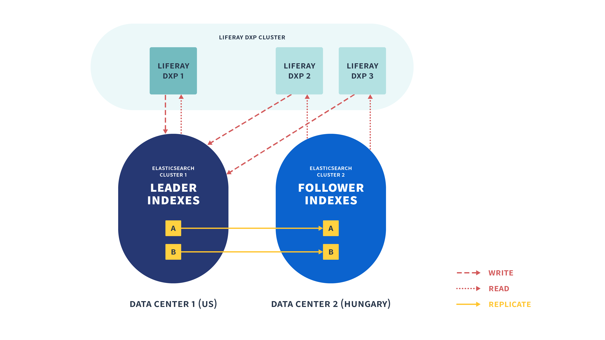

# Configuring an Example CCR Installation: Replicating Between Data Centers

> **Liferay Enterprise Search (LES) Subscribers**

Configure Liferay DXP's Cross-Cluster Replication module and Elasticsearch to set up a read-write connection from one Elasticsearch server to one Liferay DXP cluster node, and a read connection from another Elasticsearch server to a second Liferay DXP cluster node:

```important::
   To use CCR, all of your DXP cluster nodes must be running Liferay DXP 7.2 Fix Pack 5+ / Service Pack 2+.
```



This example uses two single-node Elasticsearch clusters on `localhost`, each with a copy of the same indexes. This represents the simplest scenario you can configure to reap the data locality and disaster recovery benefits of Cross-Cluster Replication.

A vanilla Liferay DXP 7.2 installation contains the indexes presented in the introductory [Cross Cluster Replication](./cross-cluster-replication.md#liferay-dxp-decide-whichindexes-to-replicate-from-the-remote-cluster) article. All the Elasticsearch clusters being used by Liferay DXP (2 clusters in this example) need these indexes.

The Elasticsearch API calls are provided in a format that allows you to  copy and paste them directly into Kibana's Dev Tools console, which can be accessed via a separate Kibana installation or through the [X-Pack Monitoring widget](./monitoring-elasticsearch.md).

```note::
   To use Kibana, remember that you have multiple Elasticsearch clusters (two single-node clusters in this example) running. The ``elasticsearch.hosts: [ "http://localhost:<port>" ]`` setting in Kibana's ``kibana.yml`` file must point to the correct port when managing the indexes and other configurations described below to avoid mixing the leader and the follower clusters. In this article, we assume that your leader Elasticserach cluster node is configured to use ``9200`` while the follower node is using ``9201`` as HTTP port.
```

## Cluster Liferay DXP 

For the example here, each Liferay DPX node requires a `Liferay Home/portal-ext.properties` file with the following contents:

```properties
cluster.link.enabled=true
```

This is a simplistic clustering configuration. See the [documentation on clustering](../../../installation-and-upgrades/setting-up-liferay-dxp/clustering-for-high-availability/clustering-for-high-availability.md) for information on how clustering works with Liferay DXP.

## Install Required Elasticsearch Plugins

Make sure you install the Elasticsearch [plugins Liferay DXP needs](https://help.liferay.com/hc/en-us/articles/360028711132-Installing-Elasticsearch#step-three-install-elasticsearch-plugins):

- `analysis-icu`
- `analysis-stempel`
- `analysis-kuromoji`
- `analysis-smartcn`

## Prerequisite for Elasticsearch 6: Enable Soft Deletes

[Soft deletes](https://www.elastic.co/guide/en/elasticsearch/reference/6.7/ccr-requirements.html) must be enabled for all existing indexes. This is not done by default on Elasticsearch 6. Before proceeding, read [here](./configuring-ccr-enabling-soft-deletes-on-elasticsearch-6.md) to configure soft deletes on your Elasticsearch 6 indexes, then resume reading here to set up CCR.

If Elasticsearch 6 is not a hard requirement for your system, you should upgrade to Elasticsearch 7 before configuring CCR. 

## Prerequisite for Elasticsearch 7: Install the Liferay Connector to Elasticsearch 7

If you are using Elasticsearch 7, you have to install the [Elasticsearch 7 connector](https://web.liferay.com/marketplace/-/mp/application/170390307) from Marketplace **version `3.0.1+`** (requires DXP 7.2 FP5+/SP2+) on all DXP cluster nodes. Read [Upgrading to Elasticsearch 7](https://help.liferay.com/hc/en-us/articles/360035444872-Upgrading-to-Elasticsearch-7) for details.

## Prerequisite for Security: Configure X-Pack Security

To encrypt communication (TLS/SSL) and enable user authentication between the Liferay DXP and the Elasticsearch nodes, you must [configure X-Pack security](https://help.liferay.com/hc/en-us/articles/360028711172-Installing-Liferay-Enterprise-Search-Security).

The high level steps are,

1. Configure X-Pack Security in your Elasticsearch clusters and make sure the node certificates are signed by the same CA and the security settings of the Leader and the Follower clusters match.

   ```note::
      TLS/SSL must be enabled for the HTTP and Transport layers on the Follower Elasticsearch cluster nodes. Liferay DXP connects to the Follower cluster over HTTP to re-follow the company indexes after a full reindex is performed.
   ```

2. Configure X-Pack Security on the DXP nodes. Configuration for the remote/write connection that all the Liferay DXP nodes will use is configured via the `ElasticsearchConfiguration.config` file, as covered in the [security article](https://help.liferay.com/hc/en-us/articles/360035444872-Upgrading-to-Elasticsearch-7). The [Configuring CCR in a Local Follower Data Center](./configuring-ccr-in-a-local-follower-data-center.md) article covers configuring security for the CCR ("read-only") connection on the local/follower DXP node.

3. If your Elastic Stack is 6.x, you must deploy Liferay's [X-Pack Security Connector](https://web.liferay.com/marketplace/-/mp/application/106163963) on all DXP nodes.

The example configurations are provided in full [here](./ccr-basic-use-case-config-reference.md).

## Install the Cross-Cluster Replication Module

1. Download the Liferay DXP Cross-Cluster Replication for Elasticsearch LPKG from the [LES downloads page](https://customer.liferay.com/downloads).

1. [Install the LPKG](../../system-administration/installing-and-managing-apps/installing-apps/installing-apps.md) into the local Liferay DXP instance.

If all your prerequisite tasks are completed and the Cross-Cluster Replication module is installed, continue by [configuring the servers in your remote data center](./configuring-ccr-in-a-remote-leader-data-center.md).
