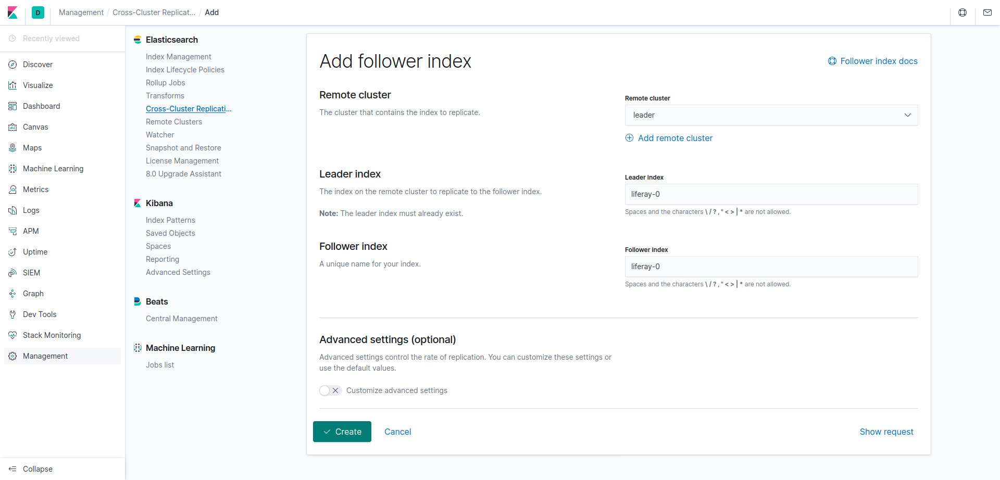
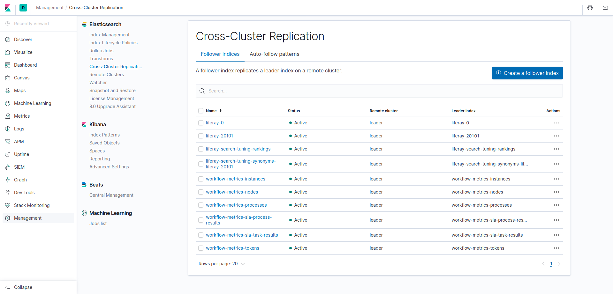
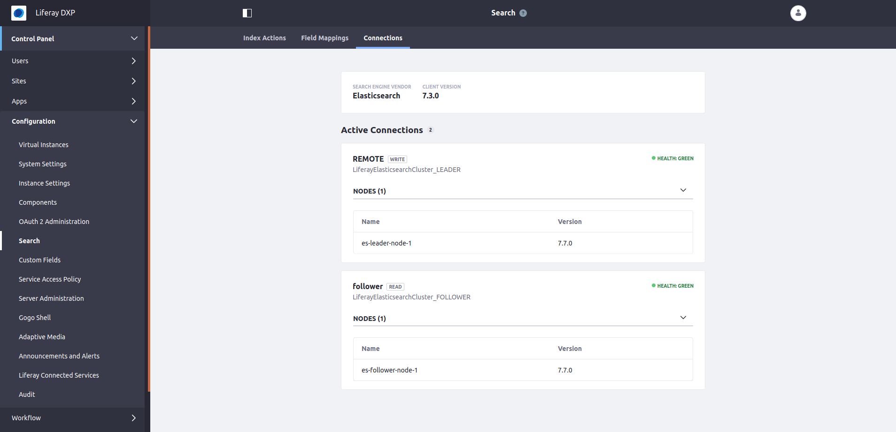

# Configuring CCR in a Local Follower Data Center

> First [configure CCR in the remote/leader data center](./configuring-ccr-in-a-remote-leader-data-center.md) before following the steps below.

The local/follower data center holds Liferay DXP cluster nodes with a read-only connection to the co-located Elasticsearch cluster, and a write-only connection to the remote/leader data center's Elasticsearch cluster.

The example configurations are also provided in full in the [CCR configuration reference guide](./ccr-basic-use-case-config-reference.md).

### Configure the Local Elasticsearch Cluster 

The local Elasticsearch cluster must hold follower (replicated; read-only) indexes, and acts as the local search engine co-located Liferay DXP nodes can read from.

Configure its `elasticsearch.yml`, specifying a `http.port` and `transport.port` that won't collide with the other Elasticsearch server:

`[Follower Elasticsearch Home]/config/elasticsearch.yml`

```yaml
cluster.name: LiferayElasticsearchCluster_FOLLOWER
http.port: 9201
node.name: es-follower-node-1
transport.port: 9301
```

Start the server. If you're in the root of the server directory, execute

```bash
./bin/elasticssearch
```

If you're just trying this out and don't yet have the proper license, start an Elasticsearch trial:

```json
POST /_license/start_trial?acknowledge=true
```

> On Elasticsearch 6, use
> 
> `POST _xpack/license/start_trial?acknowledge=true`

## Replicate the Leader Indexes

If you're configuring a new installation with CCR, you can [auto-follow](#configuring-auto-follow) the leader's indexes from the local/follower Elasticsearch cluster. For an existing installation you must [manually replicate](#manually-replicating-the-leader-indexes) the leader's indexes.

```note::
   If using auto-follow, it's advisable to delete the auto-follow patterns after the initial installation is completed. Otherwise the automatic re-following of the system and company indexes will clash with the indexes detected by the aut-follow pattern. The reason for this follows:

   A full reindex operation deletes and re-creates the system and company indexes (``liferay-0`` and ``liferay-<companyId>``). Because of this reality, these indexes are programmatically re-followed each time a reindex is performed in Liferay DXP.

   In contrast, the Search Tuning and Workflow Metrics indexes are not dropped and re-created by a full reindex, so they aren't programmatically re-followed. After the initial auto-follow configuration, the programmatic re-follow of the system and company indexes can clash with the pattern-matching follow operation performed by the auto-follow feature. Deleting the auto-follow patterns after the initial setup avoids these issues.
```

> A Liferay DXP administrative console for for conveniently managing follower indexes is planned for a future release. See [LPS-109204](https://issues.liferay.com/browse/LPS-109204) for more details and to follow the progress.

### Configuring Auto-Follow

> Only Possible with New Installations

If your new Liferay DXP/Elasticsearch Cross-Cluster Replication installation is likely to add indexes over time, or you just want to avoid manually replicating all the Liferay DXP indexes, you can leverage the auto-follow functionality of Elasticsearch.

> Refer to Elastic's auto-follow documentation: <https://www.elastic.co/guide/en/elasticsearch/reference/7.x/ccr-auto-follow.html>

Here's the overview:

1. Configure and start the leader and follower Elasticsearch nodes.
1. Connect Kibana to the follower Elasticsearch node.
1. In Kibana, go to Management &rarr; Remote Clusters and add a new remote cluster: "leader, 127.0.0.1:9300"

    ```json
    PUT _cluster/settings
    {
      "persistent": {
        "cluster": {
          "remote": {
            "leader": {
              "seeds": [
                "127.0.0.1:9300"
              ],
              "skip_unavailable": false
            }
          }
        }
      }
    }
    ```

1. In Kibana, go to Management &rarr; Cross Cluster Replication &rarr; Auto-follow patterns tab:

    Name: `liferay-follow-patterns`
    Remote cluster: `leader`
    Leader patterns: `liferay-*, workflow-*`


    Or use the `auto_follow` api endpoint:
    ```json
    PUT /_ccr/auto_follow/liferay-follow-patterns
    {
      "remote_cluster": "leader",
      "leader_index_patterns": [
        "liferay-*",
        "workflow-*"
      ],
      "follow_index_pattern": "{{leader_index}}"
    }
    ```

1. Start the Leader Liferay DXP Cluster Node and wait until it is up and running. The indexes matching the provided pattern automatically replicate into the local/follower Elasticsearch cluster. 

1. Verify in Kibana that the follower indexes have been created: in Management &rarr; Cross Cluster Replication &rarr; Follower indexes tab, you should see all matching indexes listed.

```tip::
   The auto-follow functionality also comes in handy when you add a new Virtual Instance in Liferay DXP which creates a new company index in the Leader Elasticsearch cluster. As long as it matches the auto-follow pattern, replication occurs automatically.
```

### Manually Replicating the Leader Indexes

The replication of indexes in CCR is a _pull_ type operation: it's executed from the local cluster holding the follower indexes. First you'll need to configure the leader/follower relationship between the clusters, then perform the replication on each index.

```tip::
   Restart Kibana after reconfiguring the ``kibana.yml`` to connect to your local/follower Elasticsearch cluster:

   ``elasticsearch.hosts: [ "http://localhost:9201" ]``
```

Two Elasticsearch API endpoints are called on the local Elasticsearch cluster: `_cluster/settings` and `_ccr/follow`.

First set the leader cluster:

```json
PUT /_cluster/settings
{
  "persistent" : {
    "cluster" : {
      "remote" : {
        "leader" : {
          "seeds" : [
            "127.0.0.1:9300" 
          ]
        }
      }
    }
  }
}
```

This can also be done from Kibana &rarr; Management &rarr; Remote Clusters: click on the _Add a remote cluster_ button and fill out the form.


Messages including `updating [cluster.remote.leader.seeds]` are printed in the log:

```bash
[2020-05-21T13:22:00,256][INFO ][o.e.c.s.ClusterSettings  ] [es-follower-node-1] updating [cluster.remote.leader.seeds] from [[]] to [["127.0.0.1:9300"]]
[2020-05-21T13:22:00,259][INFO ][o.e.c.s.ClusterSettings  ] [es-follower-node-1] updating [cluster.remote.leader.seeds] from [[]] to [["127.0.0.1:9300"]]
[2020-05-21T13:22:00,263][INFO ][o.e.c.s.ClusterSettings  ] [es-follower-node-1] updating [cluster.remote.leader.seeds] from [[]] to [["127.0.0.1:9300"]]
[2020-05-21T13:22:00,263][INFO ][o.e.c.s.ClusterSettings  ] [es-follower-node-1] updating [cluster.remote.leader.seeds] from [[]] to [["127.0.0.1:9300"]]
```

Once the leader is configured, use the Follow API to perform the initial index replication of the leader's indexes into the local/follower cluster:

```json
PUT /liferay-20101/_ccr/follow?wait_for_active_shards=1
{
  "remote_cluster" : "leader",
  "leader_index" : "liferay-20101"
}
```

This can also be done through Kibana &rarr; Management &rarr; Cross Cluster Replication: click on the _Create a follower index_ button and fill out the form.



```note::
   The value ``leader`` is used in the API calls above, as it is the default `alias to the remote cluster <https://www.elastic.co/guide/en/elasticsearch/reference/7.x/ccr-getting-started.html#ccr-getting-started-remote-cluster>`_: if you use a different alias, change this value in the API calls, and set the same value in the ``remoteClusterAlias`` property of the ``CrossClusterReplicationConfiguration``.
```

Messages indicating that the shard has started and that the leader is being tracked will appear in the console:

```bash
[2020-05-21T13:31:29,888][INFO ][o.e.c.r.a.AllocationService] [es-follower-node-1] Cluster health status changed from [YELLOW] to [GREEN] (reason: [shards started [[liferay-20101][0]] ...]).
[2020-05-21T13:31:29,902][DEBUG][o.e.a.a.c.s.r.RestoreClusterStateListener] [es-follower-node-1] restore of [_latest_/_latest_] completed
[2020-05-21T13:31:29,940][INFO ][o.e.x.c.a.ShardFollowTasksExecutor] [es-follower-node-1] [liferay-20101][0] Starting to track leader shard [liferay-20101][0]
[2020-05-21T13:31:29,972][INFO ][o.e.x.c.a.ShardFollowNodeTask] [es-follower-node-1] [liferay-20101][0] following leader shard [liferay-20101][0], follower global checkpoint=[-1], mapping version=[11], settings version=[1]
```

Repeat the above PUT call for all the indexes you see listed at Control Panel &rarr; Configuration &rarr; Search &rarr; Field Mappings. For example, these indexes are present in most systems:

- liferay-0
- liferay-20101
- liferay-search-tuning-rankings
- liferay-search-tuning-synonyms-liferay-20101
- workflow-metrics-instances
- workflow-metrics-nodes
- workflow-metrics-processes
- workflow-metrics-sla-instance-results
- workflow-metrics-sla-task-results
- workflow-metrics-tokens

> Checkpoint---Navigate to Management &rarr; Cross Cluster Replication in Kibana and you see something like this:



Now the local/follower Elasticsearch cluster knows how to replicate from the remote/leader Elasticsearch cluster. The last step is to wire up the local Liferay DXP cluster node so it reads from this local Elasticsearch cluster's follower indexes, and writes to the remote/leader Elasticsearch cluster.

## Configure the Local Liferay DXP Cluster Node

> Configure Tomcat to use different ports than your remote DXP node. We use `9080` as the HTTP port in this example setup.

Provide a `portal-ext.properties` file with these contents:

```properties
cluster.link.enabled=true
```

Then configure the Liferay Connector to Elasticsearch X [6 or 7] by providing a configuration file in the `Liferay Home/osgi/configs` folder. If using Elasticsearch 7, name it

```bash
com.liferay.portal.search.elasticsearch7.configuration.ElasticsearchConfiguration.config
```

If using Elasticsearch 6, the configuration file is named

```bash
com.liferay.portal.search.elasticsearch6.configuration.ElasticsearchConfiguration.config
```

This file configures the write-enabled connection to the remote Elasticsearch cluster with the leader indexes. Give it these contents:

```properties
clusterName = "LiferayElasticsearchCluster_LEADER"
operationMode = "REMOTE"
transportAddresses = ["localhost:9300"]
```

Now configure the read-only connection to the local Elasticsearch server with the follower indexes. Provide a configuration file named 

```bash
com.liferay.portal.search.elasticsearch.cross.cluster.replication.internal.configuration.ElasticsearchConnectionConfiguration-follower.config
```

Give it these contents:

```properties
connectionId = "follower"
clusterName = "LiferayElasticsearchCluster_FOLLOWER"
networkHostAddress = "http://localhost:9201"
transportAddresses = ["localhost:9301"]

#networkHostAddress = "https://localhost:9201"
#authenticationEnabled = B"true"
#username = "elastic"
#password = "liferay"
#certificateFormat = "PEM"
#sslKeyPath = "/PATH/TO/elastic-certificates.key"
#sslCertificatePath = "/PATH/TO/elastic-certificates.crt"
#sslCertificateAuthoritiesPaths = "/PATH/TO/ca.crt"
#transportSSLVerificationMode = "certificate"
#transportSSLEnabled = B"true"
```

You can use any suffix (`-follower` in this example) for the configuration file name, but for consistency you should make it identical to the `connectionId` property in the configuration.

```note::
   **To enable security**, assuming you've gone through the `prerequisite setup <./configuring-ccr-a-basic-use-case.md#prerequisite-for-security-configure-x-pack-security>`__, uncomment the properties in the above configuration, update the settings to match your environment and remove the ``networkHostAddress = "http://localhost:9201"`` property (the new property is only different in that it uses ``https``). 
```

The connection is configured. Next enable CCR by providing a configuration file named

```bash
com.liferay.portal.search.elasticsearch.cross.cluster.replication.internal.configuration.CrossClusterReplicationConfiguration.config
```

Give it the following contents:

```properties
ccrEnabled = B"true"
ccrLocalClusterConnectionConfigurations = ["localhost:9080=follower"]
remoteClusterAlias = "leader"
```

```note::
   The local/follower DXP node used ``9080`` as its HTTP port. If you have a different port, adjust the portal address in ``ccrLocalClusterConnectionConfigurations`` accordingly.
```

Now start the local Liferay DXP Cluster node.

## Verify the Setup

On the follower DXP cluster node, navigate to Control Panel &rarr; Configuration &rarr; Search and select the _Connections_ tab. Your connections look like this:



```note::
   On Elasticsearch 6 the Connections tab only appears in the Search administrative console if the CCR module is installed and running. Therefore, it's only available in the local Liferay DXP nodes.
```

If you are using Elasticsearch 6, the Connections page looks a little different:


> Don't forget to delete the *auto-follow* pattern from the Follower Elasticsearch cluster to avoid exceptions being reported during a reindex operation.

Now CCR is configured. If you run into trouble with your configuration, check out the [troubleshooting guide](./troubleshooting-cross-cluster-replication.md).
