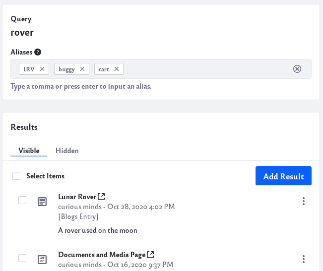
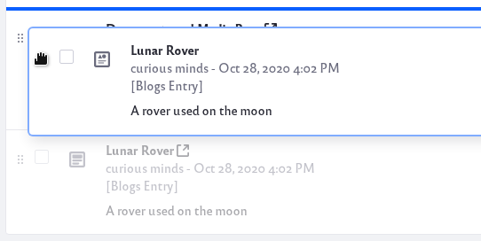
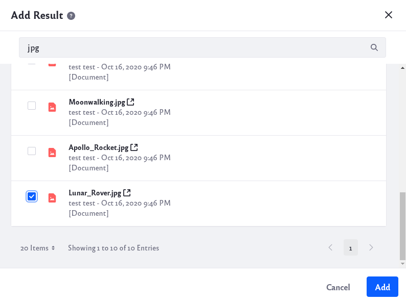
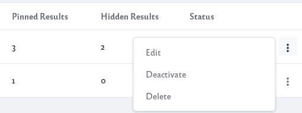

# Ranking Results

Result Rankings provides a way for you (the admin) to manually change the list of results that are returned for specific keywords.

With Results Rankings you can:

* Designate which results should be pinned to the top of the results.
* Choose to hide certain results for a search.
* Add other results that normally wouldn't be returned for a certain keyword.
* Re-order pinned results with a drag-and-drop interface.

Note that these rankings apply only to searches using the newer search widgets (Search Bar, Search Results, etc.). The rankings you customize do not apply to the legacy Search portlet results or to the individual application search bars.

## Requirement and Limitations

Result Rankings are only supported when using Elasticsearch as your search engine. If you are using Solr or need to install Elasticsearch, check out the [Getting Started with Elasticsearch](../installing-and-upgrading-a-search-engine/elasticsearch/getting-started-with-elasticsearch.md) page.

Result Ranking entries are configured in a Virtual Instance, but are not applied only to that Virtual Instance. Instead, custom rankings made in one virtual Instance are shared across all Virtual Instances in the deployment, and even across separate deployments sharing an Elasticsearch cluster (in a multi-tenant scenario). Therefore, Result rankings shouldn’t be used when connecting multiple Liferay DXP deployments to the same Elasticsearch cluster unless you intend for the same Result Rankings to apply to every Liferay DXP deployment. See [LPS-101291](https://issues.liferay.com/browse/LPS-101291) for more information.

An existing Result Rankings cannot be renamed. Renaming requires recreating the ranking under a different name. See [LPS-96357](https://issues.liferay.com/browse/LPS-96357) for more information.

## Creating and Managing Result Rankings

To create a new Result Rankings,

1. Navigate to *Applications* → *Search Tuning* → *Result Rankings*.

    

1. Click the Add icon () to add a new Result Rankings.

1. Enter the keyword or phrase you would like to use. Click on the *Customize Results* button.

1. A search query is executed and the results are displayed.

    The Result Rankings can be applied to additional keywords by adding words or phrases into the Aliases field. Click *Enter* or use a comma to input  additional aliases.

    

    Click on the *X* next to a keyword to remove an alias.

1. To pin a specific result, click on the Options icon () and click on *Pin Result*. You can also hover your mouse over a result and click on the pin icon.

    

    Once more than one result is pinned, you can re-order your pinned results. Simply move your cursor to the left edge of the item you wish to re-order. Click and hold the item and drag it up or down your results list.

    

    As you drag, you will see your selected item as a rectangular box that you can move. The highlighted blue line indicates where the item will be inserted.

1. To hide a specific result, click on the Options icon () and click on *Hide Result*. You can also hover your mouse over a result and click on the hide result icon.

    

    The list of hidden results can be found by clicking on the *Hidden* tab of the results. To make a hidden result visible again simply click on the Options icon () and click on *Show Result*. You can also hover your mouse over a result and click on the show result icon. 

1. To add additional results, click on the Add Result button. In the new window, use other search terms to locate the additional results you wish to add. Mark the results you would like to add with a check and click the Add button.

    

    In the list of results you should now see the additional results you just added.

 1. Finish configuring your Result Rankings and click *Save* to save your changes.

 1. If you like, you can choose to deactivate a specific Result Rankings. Simply click on the Options icon () and click on *Deactivate*.

    

    To make a Result Rankings active again, simply click on the Options icon () and click *Activate*. 

    If you wish to permanently delete a Result Rankings, simply click on the Option icon () and click *Delete*.

## Result Rankings Scope and Permissions

Because configuration of Result Rankings happens at the virtual instance scope, there are scoping and permissions behaviors to be aware of.

Scope is disregarded for pinned results: Pinned results existing in Site A always appear in searches from Site B, even if the Search Bar Scope is set to *This Site* as opposed to searching *Everything*.

Search from Result Rankings is global: When searching for results in Result Rankings admin, relevant results from all sites are returned.

Permissions are applied as usual: If a User doesn’t have permission to see an asset, pinning it does not make it appear in the search results for that User.

## Result Rankings Aliases versus Synonyms Sets

The similarities between Result Rankings and Synonyms Sets might cause some confusion. Remember that [Synonyms Sets ](defining-synonym-sets.md) expand the search to include results matched by additional (synonymous) keywords, so more results are returned if there are matches to the synonyms.

Result Rankings are just keywords that also have the particular ranking interventions applied to them. Only the searched keyword is matched to results, and then, the pins, hides, re-ordering, and additional results take effect after that. Of course, if you add a Synonym Set that includes an identical set of search terms as the Result Ranking you configure, the features can be used together. All the synonymous terms return the same result set, with the customized rankings applied on top.
