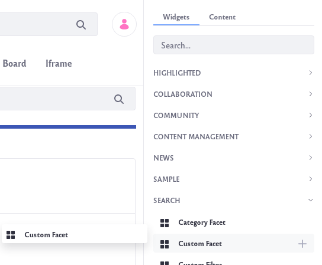
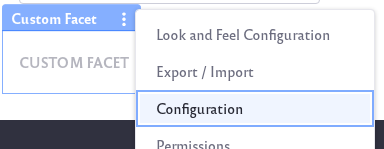

# Custom Facet

Each of the search facets are configurable, allowing you to change the look and feel of the facet. But the Custom Facet let's you create an entirely new facet with much more customization.

## Configuring the Custom Facet

To add a Custom facet, follow these steps:

1. Click on the Add icon () at the top of the page.

1. Locate the Custom Facet and drag it to the collection of facets on the left. The Custom Facet is found under *Search* section of widgets.

    

1. Click on the Options icon () of facet and click *Configuration*.

    

1. The Custom Facet has several configuration options:

    * **Display Settings**: Choose between *Default*, *Compact Layout*, and *Label Layout*. The Default layout shows checkboxes next to each term but the Compact layout does not. The Label layout shows small clickable labels for each term.

    * **Advanced Configuration**:

        * **Aggregation Field**: Enter the name of the indexed field to aggregate results by. This must be a non-analyzed keyword field. See below for more information.
        * **Custom Heading**: Enter the heading to display for this facet. If not set, the aggregated field name is displayed.
        * **Custom Parameter Name**: Specify a URL parameter name for selected values. If not set, the aggregated field name is used.
        * **Max Terms**: Set the maximum number of facet terms to display, regardless of how many matching terms are found for the facet.
        * **Frequency Threshold**: Set the minimum frequency required for terms to appear in the list of facet terms. For example, if the frequency threshold of a facet is set to 3, a term with two matching results will not appear in the term result list.
        * **Display Frequencies**: Choose whether or not to display the term frequencies.
        * **Federated Search Key**: Enter the key of an alternate Search this widget is participating on. If not set, this widget will participate on the default search. This value will typically be the name of an application-defined index.

        Click on *Save* button to save changes.

## Finding Indexed Fields

To use the Custom Facet, you must know which non-analyzed keyword field to specify. 

To browse the entire list of available fields, inspect the field mappings from Control Panel &rarr; Configuration &rarr; Search. Alternatively, use your search engine's API. 

For Elasticsearch, access the field mappings from your terminal using CURL to call the [Get Mapping API](https://www.elastic.co/guide/en/elasticsearch/reference/7.x/indices-get-mapping.html):

    curl -X GET "localhost:9200/_mapping/LiferayDocumentType"?pretty

Solr uses the [ListFields API](https://lucene.apache.org/solr/guide/6_6/schema-api.html#SchemaAPI-ListFields):

    curl http://localhost:8983/solr/liferay/schema/

Here's a snippet of output from the Elasticsearch example:

    "ddmStructureKey": {
        "store": true,
        "type": "keyword"
    },
    "ddmTemplateKey": {
        "store": true,
        "type": "keyword"
    },
    "defaultLanguageId": {
        "store": true,
        "type": "keyword"
    },
    "description": {
        "store": true,
        "term_vector": "with_positions_offsets",
        "type": "text"
    },
    "discussion": {
        "store": true,
        "type": "keyword"
    },

Use Custom Fields to aggregate facet terms by shared non-analyzed keyword field values.