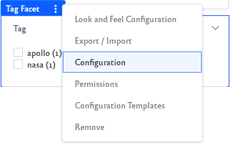

# Tag and Category Facet

The Tag Facet narrows search results for any assets with tags that match the search keyword. Likewise, the Category Facet narrows search results for any categorized assets that match the search keyword. Each match will appear as a facet term.

## Configuring the Tag Facet and the Category Facet

The Tag Facet and the Category Facet contain identical configuration options. To configure, click on the Options icon () of facet and click *Configuration*.

* **Display Settings**: Choose between *Default*, *Compact Layout*, and *Label Layout*. The Default layout shows checkboxes next to each term but the Compact layout does not. The Label layout shows small clickable labels for each term.

* **Advanced Configuration**:

    * **Tag or Category Parameter Name**: Change the parameter name in the URL for the Facet. The default is *tag* or *category*. 
    * **Max Terms**: Set the maximum number of facet terms to display, regardless of how many matching terms are found for the facet.
    * **Frequency Threshold**: Set the minimum frequency required for terms to appear in the list of facet terms. For example, if the frequency threshold of a facet is set to 3, a term with two matching results will not appear in the term result list.
    * **Display Frequencies**: Choose whether or not to display the term frequencies.

Click on *Save* button to save changes.