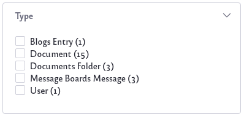
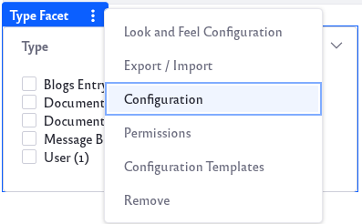
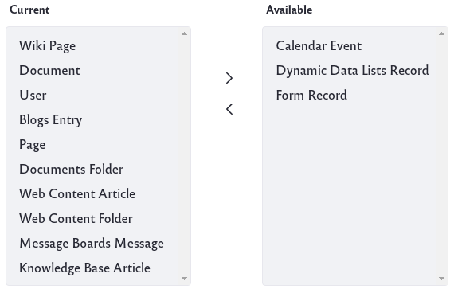

# Type Facet

The Type Facet narrows search results down to those associated with a certain Asset Type. Each Type with content matching the searched keyword appears as a facet term.

By default, all available Asset Types are displayed as facet terms:

* Blogs Entry
* Calendar Event
* Document
* Documents Folder
* Dynamic Data Lists Record
* Form Record
* Knowledge Base Article
* Message Boards Message
* Page
* User
* Web Content Article
* Web Content Folder
* Wiki Page

## Configuring the Type Facet

To configure the Type Facet, open the Options menu () of the facet and click *Configuration*.

**Display Settings:** Choose between *Default*, *Compact Layout*, and *Label Layout*. The Default layout shows checkboxes next to each term but the Compact layout does not. The Label layout shows small clickable labels for each term.

The Advanced Configuration section contains additional options: 

**Type Parameter Name:** Change the parameter name in the URL for the Facet. The default is *type*. 

**Frequency Threshold:** Set the minimum frequency required for terms to appear in the list of facet terms. For example, if the frequency threshold of a facet is set to 3, a term with two matching results will not appear in the term result list.

**Display Frequencies:** Choose whether or not to display the term frequencies.

**Current and Available:** Choose which asset types are visible in the facet. To remove types, select from the Current section by clicking and highlighting. Click the right arrow and move the Asset Type from *Current* to *Available*. Add Asset Types by moving them to the Current section.

Once finished, click the *Save* button.
