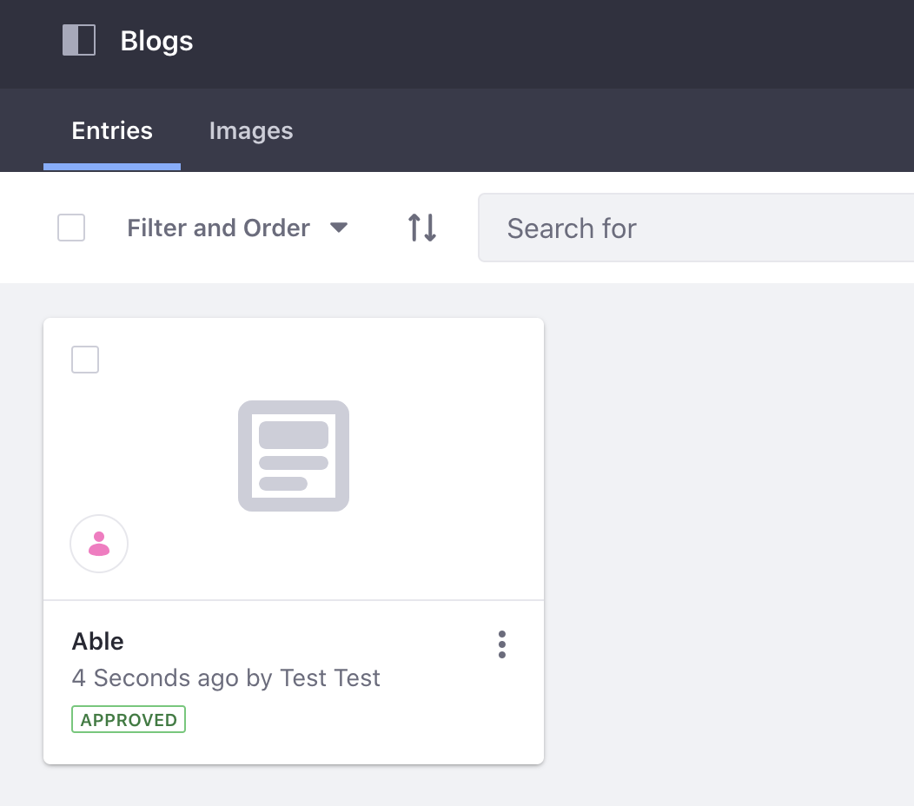

# Blog API Basics

Liferay's REST API's provide services for the Blogs application to add, modify, and delete blog posts and images. 

Start by seeing an example of adding a new blog post.

## Adding a Blog Post

1. Start Liferay DXP. If you don't already have a docker container, use

   ```bash
   docker run -it -p 8080:8080 [$LIFERAY_LEARN_DXP_DOCKER_IMAGE$]
   ```

1. Download and unzip [Blog API Basics](./liferay-r3g4.zip).

   ```bash
   curl https://learn.liferay.com/dxp/latest/en/content-authoring-and-management/blogs/developer-guide/liferay-r3g4.zip -O
   ```

   ```bash
   unzip liferay-r3g4.zip
   ```

2. [Find your site's ID](../../../headless-delivery/consuming-apis/consuming-rest-services.md#identify-the-site-containing-the-data). You'll use this in different service calls below.

3. Use the cURL script to add a new blog post to your Site. On the command line, navigate to the `curl` folder. Execute the `BlogPosting_POST_ToSite.sh` script with your site ID as a parameter.

    ```bash
    ./BlogPosting_POST_ToSite.sh 1234
    ```

    The JSON response shows a new blog post has been added:

    ```bash
    "alternativeHeadline" : "",
    "articleBody" : "Foo",
    "creator" : {
    "additionalName" : "",
    "contentType" : "UserAccount",
    "familyName" : "Test",
    "givenName" : "Test",
    "id" : 20125,
    "name" : "Test Test"
    },
    "customFields" : [ ],
    "dateCreated" : "2021-07-21T21:26:55Z",
    "dateModified" : "2021-07-21T21:26:55Z",
    "datePublished" : "2021-07-21T21:26:00Z",
    "description" : "",
    "encodingFormat" : "text/html",
    "friendlyUrlPath" : "able",
    "headline" : "Able",
    "id" : 38511,
    "keywords" : [ ],
    "numberOfComments" : 0,
    "relatedContents" : [ ],
    "siteId" : 20121,
    "taxonomyCategoryBriefs" : [ ]
    ```

1. Go to the Blogs application by navigating to *Administration Menu* &rarr; *Content & Data* &rarr; *Blogs*. See that a new blog post has been added.

    

1. The REST service can also be called with a Java class. Navigate out of the `curl` folder and into the `java` folder. Compile the source files with the following command:

    ```bash
    javac -classpath .:* *.java
    ```

1. Run the `BlogPosting_POST_ToSite` class with the following command. Replace the `siteId` value with your site's ID:

    ```bash
    java -classpath .:* -DsiteId=1234 BlogPosting_POST_ToSite
    ```

## Examine the cURL Command

The `BlogPosting_POST_ToSite.sh` script calls the REST service with a cURL command. 

```{literalinclude} ./blog-api-basics/resources/liferay-r3g4.zip/curl/BlogPosting_POST_ToSite.sh
    :language: bash
```

Here are the command's arguments:

| Arguments | Description |
| --------- | ----------- |
| `-H "Content-Type: application/json"` | Indicates that the request body format is JSON. |
| `-X POST` | The HTTP method to invoke at the specified endpoint |
| `"http://localhost:8080/o/headless-delivery/v1.0/sites/${1}/blog-postings"` | The REST service endpoint |
| `-d "{\"articleBody\": \"Foo\", \"headline\": \"Able\"}"` | The data you are requesting to post |
| `-u "test@liferay.com:test"` | Basic authentication credentials |

```note::
   Basic authentication is used here for demonstration purposes. For production, you should authorize users via `OAuth2 <../../../installation-and-upgrades/securing-liferay/configuring-sso/using-oauth2/introduction-to-using-oauth2.md>`_.
```

The other cURL commands use similar JSON arguments.

## Examine the Java Class

## Get Site Blog Posts

## Get a Blog Post

## Patch a Blog Post

## Put a Blog Post

## Delete a Blog Post

## Blog Image Services

