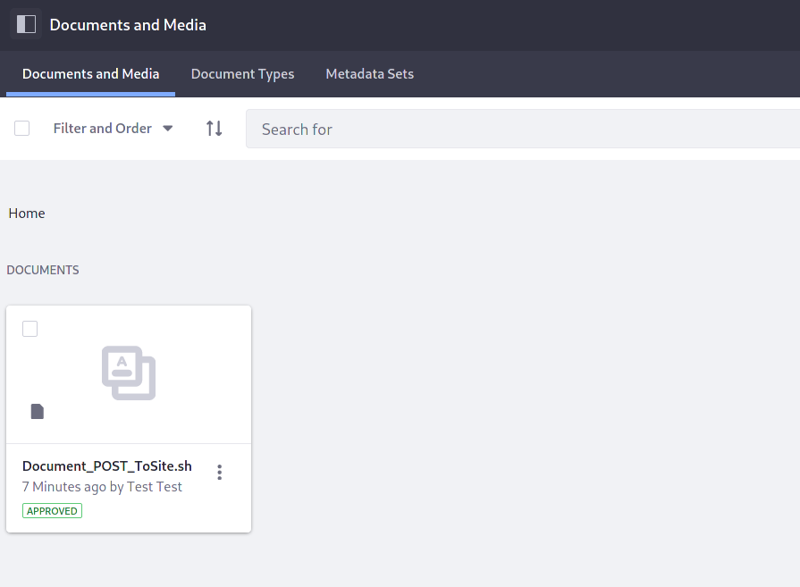
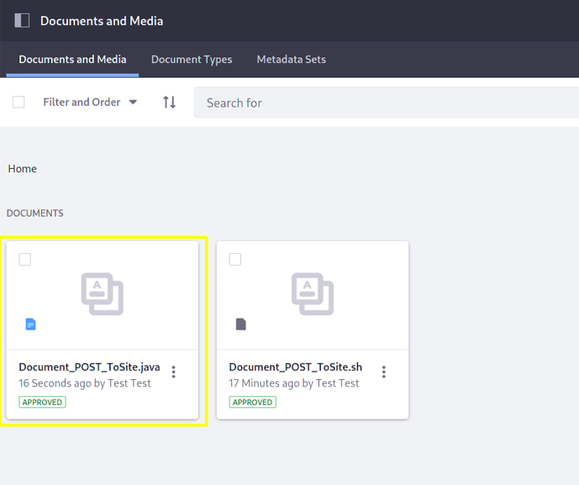
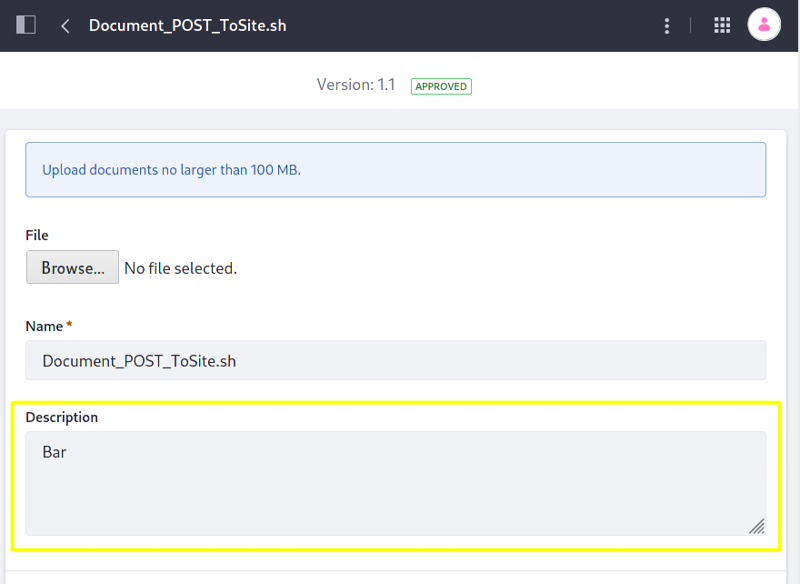
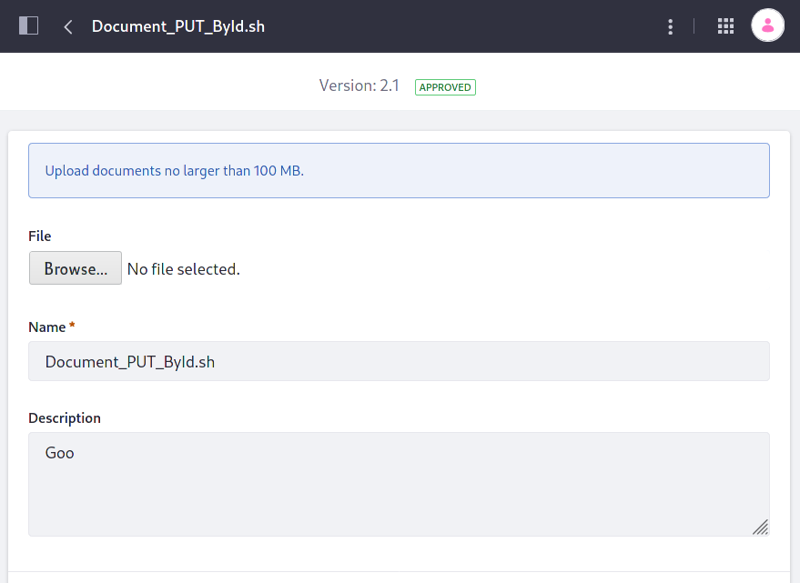

# Document API Basics

Liferay's headless delivery application provides REST services for [Documents and Media](../../sharing-documents-and-media.md). There are services to add documents and folders, list their information, modify them, delete them and more. Here you'll call those services using curl commands and Java classes. 

Start with uploading documents using an example curl command and Java class.

## Uploading Documents With REST Services

1.  Start the Liferay Docker image:

    ```bash
    docker run -it -p 8080:8080 [$LIFERAY_LEARN_DXP_DOCKER_IMAGE$]
    ```

1. Sign in to Liferay.

    ```tip::
    Using basic authentication while signed in to Liferay is an easy way to test services.
    ```

1. [Find your site's ID](../../../../headless-delivery/consuming-apis/consuming-rest-services.md#identify-the-site-containing-the-data). You'll use this ID in several service calls.

1. Download and unzip the [example command code](https://learn.liferay.com/dxp/7.x/en/content-authoring-and-management/documents-and-media/developer-guide/api/liferay-g9i6.zip):

    ```bash
    curl https://learn.liferay.com/dxp/7.x/en/content-authoring-and-management/documents-and-media/developer-guide/api/liferay-g9i6.zip -O
    ```

    ```bash
    unzip liferay-g9i6.zip
    ```
Curl commands are in the project's `curl` folder and Java source files are in the `java` folder.

Use the curl command in `curl/Document_POST_ToSite.sh` to upload that file (i.e., `Document_POST_ToSite.sh`) to your site's Documents and Media. 

1. On the command line, navigate to the `curl` folder. 

1. Copy the `Document_POST_ToSite.sh` file contents to the command line. Then replace `${1)` with your site ID and replace the user credentials with your own. For example,

    ```bash 
    curl \
        -F "file=@Document_POST_ToSite.sh" \
        -H "Content-Type: multipart/form-data" \
        -X POST \
        "http://localhost:8080/o/headless-delivery/v1.0/sites/20121/documents" \
        -u "test@liferay.com:test"
    ```

1. Execute the curl command.

    The `Document_POST_ToSite.sh` file uploads to your site's Documents and Media.

    

    The command response looks like this:

    ```bash 
    {
      "actions" : {
        "get" : {
          "method" : "GET",
          "href" : "http://localhost:8080/o/headless-delivery/v1.0/documents/{documentId}"
        },
        "replace" : {
          "method" : "PUT",
          "href" : "http://localhost:8080/o/headless-delivery/v1.0/documents/{documentId}"
        },
        "update" : {
          "method" : "PATCH",
          "href" : "http://localhost:8080/o/headless-delivery/v1.0/documents/{documentId}"
        },
        "delete" : {
          "method" : "DELETE",
          "href" : "http://localhost:8080/o/headless-delivery/v1.0/documents/{documentId}"
        }
      },
      "adaptedImages" : [ ],
      "contentUrl" : "/documents/20121/0/Document_POST_ToSite.sh/f56e88a6-0cae-c67f-dd14-6e891837b5b9?version=1.0&t=1617977639864",
      "creator" : {
        "additionalName" : "",
        "contentType" : "UserAccount",
        "familyName" : "Test",
        "givenName" : "Test",
        "id" : 20125,
        "name" : "Test Test"
      },
      "customFields" : [ ],
      "dateCreated" : "2021-04-09T14:13:59Z",
      "dateModified" : "2021-04-09T14:13:59Z",
      "description" : "",
      "documentFolderId" : 0,
      "documentType" : {
        "availableLanguages" : [ ],
        "contentFields" : [ ],
        "description" : "",
        "name" : "Basic Document"
      },
      "encodingFormat" : "application/x-sh",
      "fileExtension" : "sh",
      "id" : 38301,
      "keywords" : [ ],
      "numberOfComments" : 0,
      "relatedContents" : [ ],
      "siteId" : 20121,
      "sizeInBytes" : 183,
      "taxonomyCategoryBriefs" : [ ],
      "title" : "Document_POST_ToSite.sh"
    }
    ```

    ```note:: 
     The response includes ``Document_POST_ToSite.sh`` document's newly assigned `id`. Note the ID for later commands.
     ```

Next use the `Document_POST_ToSite` class to upload its source file `Document_POST_ToSite.java`.

1. Go to the `java` folder and compile the Java source files.

    ```bash
    cd ../java
    ```

    ```bash
    javac -classpath .:* *.java
    ```

1. Upload the `Document_POST_ToSite.java` file to Documents and Media by running the `Document_POST_ToSite` class, replacing the `siteId` system property value below with your site's ID.

    ```bash
    java -classpath .:* -DsiteId=1234 Document_POST_ToSite
    ```

    The `Document_POST_ToSite.java` document uploads to Documents and Media.

    ```note:: 
    If your user and password aren't ``test@liferay.com`` and ``test``, respectively, replace those values in the ``Document_POST_ToSite.java`` file and recompile the class before running it.
    ```

    ```tip:: 
    A comment at the top of each example Java class includes a command to run the class.
    ```



Look at the REST service call code, starting with the curl command. 

## Examine the CURL Command

The curl command in the `Document_POST_ToSite.sh` posts the  `Document_POST_ToSite.sh` to a site via this `headless-delivery` application REST service call.

```bash 
curl -F "file=@Document_PUT_ToSite.sh" -H "Content-Type: multipart/form-data" -X POST "http://localhost:8080/o/headless-delivery/v1.0/sites/${1}/documents" -u "test@liferay.com:test"
```

Here are the command's arguments:

| Arguments | Description |
| :--- | :---------- |
| `-F "file=@Document_POST_ToSite.sh"` | The file to post. |
| `-H "Content-Type: multipart/form-data"` | The media type ([MIME type](https://en.wikipedia.org/wiki/Media_type)) being posted. |
| `-X POST` | The HTTP method to invoke at the specified endpoint. |
| `"http://localhost:8080/o/headless-delivery/v1.0/sites/${1}/documents"` | The REST service endpoint. |
| `-u "test@liferay.com:test"` | User credentials. |

Other curl commands for the `Document` and `DocumentFolder` REST services use similar arguments.

Next, examine the Java code in `Document_POST_ToSite.java`.

## Examine the Java Service Call

Here's the code from `Document_POST_ToSite.java`:

```java
/**
 * java -classpath .:* -DsiteId=1234 Document_POST_ToSite
 */
public static void main(String[] args) throws Exception {
	DocumentResource.Builder builder = DocumentResource.builder();

	DocumentResource documentResource = builder.authentication(
		"test@liferay.com", "test"
	).build();

	Document document = documentResource.postSiteDocument(
		Long.valueOf(System.getProperty("siteId")), new Document(),
		new HashMap<String, File>() {
			{
				put("file", new File("Document_POST_ToSite.java"));
			}
		});

	System.out.println(document);
}
```

This class invokes a service using only three lines of code that do these things:

1. Get a `DocumentResource.Builder`.
1. Use the `DocumentResource.Builder` to authenticate a user with a `DocumentResource` instance.
1. Call the `DocumentResource.postSiteDocument` method, passing in a site ID, a `Document` object for the uploaded, and a hash map that specifies the file to upload. The file is arbitrary--this example uses local file `Document_POST_ToSite.java` for convenience.

```note::
The ``main`` method's comment demonstrates running the class.
```

The other example Java classes are similar to this one, but call different `DocumentResource` methods.

```important::
See `DocumentResource <https://docs.liferay.com/dxp/apps/headless/latest/javadocs/com/liferay/headless/delivery/resource/v1_0/DocumentResource.html>`_ for service details.
```

The following sections demonstrate calling other common `Document` and `DocumentFolder` REST services using curl and Java.

## Listing Your Site's Documents

You can list a site's documents by executing the following curl or Java command. Make sure to enter your site ID in place of `${1}` in the curl command or in place of the `siteId` value in the Java command.

### Documents_GET_FromSite.sh

```bash
curl \
    "http://localhost:8080/o/headless-delivery/v1.0/sites/${1}/documents" \
    -u "test@liferay.com:test"
```

### Documents_GET_FromSite.java

Command:

```bash 
java -classpath .:* -DsiteId=1234 Documents_GET_FromSite
```

Code:

```java
public static void main(String[] args) throws Exception {
	DocumentResource.Builder builder = DocumentResource.builder();

	DocumentResource documentResource = builder.authentication(
		"test@liferay.com", "test"
	).build();

	Page<Document> page = documentResource.getSiteDocumentsPage(
		Long.valueOf(System.getProperty("siteId")), null, null, null, null,
		Pagination.of(1, 2), null);

	System.out.println(page);
}
```

The site's `Document` objects are listed in JSON.

## Getting a Document's Fields

You can get a `Document`'s fields by executing the following curl or Java command. Replace the command's `${1}` or `documentId` with the `Document`'s ID.

```tip:: 
Use ``Documents_GET_FromSite.[sh|java]`` to get site ``Document`` IDs.
```

### Document_GET_ByID.sh

```bash
curl \
    "http://localhost:8080/o/headless-delivery/v1.0/documents/${1}" \
    -u "test@liferay.com:test"
```

### Document_GET_ByID.java

Command: 

```bash 
java -classpath .:* -DdocumentId=1234 Document_GET_ById
```

Code:

```java
public static void main(String[] args) throws Exception {
	DocumentResource.Builder builder = DocumentResource.builder();

	DocumentResource documentResource = builder.authentication(
		"test@liferay.com", "test"
	).build();

	Document document = documentResource.getDocument(
		Long.valueOf(System.getProperty("documentId")));

	System.out.println(document);
}
```

The `Document` fields are listed in JSON.

## Updating a Document

`Document`'s PATCH services update a `Document` and its fields. You can update a `Document` by executing the following curl or Java command. Replace the command's `${1}` or `documentId` with the `Document`'s ID.

### Document_PATCH_ById.sh

```bash 
curl \
    -F "document={\"description\": \"Bar\"}" \
    -F "file=@Document_POST_ToSite.sh" \
    -H  "Content-Type: multipart/form-data; boundary=ARBITRARY" \
    -X PATCH \
    "http://localhost:8080/o/headless-delivery/v1.0/documents/${1}" \
    -u "test@liferay.com:test"
```

The first form data part specifies a new value for the `Document`'s `description` field. The second form data part specifies the updated file to upload.

### Document_PATCH_ById.java

Command: 

```bash 
java -classpath .:* -DdocumentId=1234 Document_PATCH_ById
``` 

Code:

```java 
public static void main(String[] args) throws Exception {
	DocumentResource.Builder builder = DocumentResource.builder();

	DocumentResource documentResource = builder.authentication(
		"test@liferay.com", "test"
	).build();

	Document document = documentResource.patchDocument(
		Long.valueOf(System.getProperty("documentId")),
		new Document() {
			{
				description = "Bar";
			}
		},
		new HashMap<String, File>() {
			{
				put("file", new File("Document_POST_ToSite.java"));
			}
		});

	System.out.println(document);
}
```

The Java code above calls `DocumentResource`'s `patchDocument` method, passing in the `Document`'s ID, a `Document` object that includes a field to update, and the updated file to upload.

The above commands update the `Document`'s description to "Bar".



## Replacing a Document

`Document`'s PUT services replace the `Document` and its fields entirely. You can replace a `Document` by executing the following curl or Java command. Set the command's `${1}` or `documentId` to your `Document`'s ID.

### Document_PUT_ById.sh 

```bash 
curl \
    -F "document={\"description\": \"Goo\", \"title\": \"Document_PUT_ById.sh\"}" \
    -F "file=@Document_PUT_ById.sh" \
    -H "Content-Type: multipart/form-data; boundary=ARBITRARY" \
    -X PUT \
    "http://localhost:8080/o/headless-delivery/v1.0/documents/${1}" \
    -u "test@liferay.com:test"
``` 

The first form data part specifies new `description` and `title` field values. The second form data part sets replacement file to upload.

### Document_PUT_ById.java

Command:

```bash
java -classpath .:* -DdocumentId=1234 Document_PUT_ById
```

Code:

```java
public static void main(String[] args) throws Exception {
	DocumentResource.Builder builder = DocumentResource.builder();

	DocumentResource documentResource = builder.authentication(
		"test@liferay.com", "test"
	).build();

	Document document = documentResource.putDocument(
		Long.valueOf(System.getProperty("documentId")),
		new Document() {
			{
				description = "Goo";
				title = "Document_PUT_ById.java";
			}
		},
		new HashMap<String, File>() {
			{
				put("file", new File("Document_PUT_ById.java"));
			}
		});

	System.out.println(document);
}
```

The Java code above calls `DocumentResource`'s `putDocument` method, passing in the `Document`'s ID, a `Document` object that includes values for the `Document`'s `description` and `title` fields, and a replacement file to upload.

The above commands replace `Document` instances with completely new ones that have the new titles "Document_PUT_ById.sh" and "Document_PUT_ById.java", and the description "Goo".

```warning::
   Unless you want to use the current ``Document``'s title, make sure to specify the ``title`` value you want for the replacement ``Document``.
```



## Deleting a Document

You can delete a `Document` by executing the following curl or Java command. Replace the command's `${1}` or `documentId` with the `Document`'s ID.

### Document_DELETE_ById.sh

```bash
curl \
    -X DELETE \
    "http://localhost:8080/o/headless-delivery/v1.0/documents/${1}" \
    -u "test@liferay.com:test"
```

### Document_DELETE_ById.java 

Command

```bash 
java -classpath .:* -DdocumentId=1234 Document_DELETE_ById
```

Code:

```java
public static void main(String[] args) throws Exception {
	DocumentResource.Builder builder = DocumentResource.builder();

	DocumentResource documentResource = builder.authentication(
		"test@liferay.com", "test"
	).build();

	documentResource.deleteDocument(
		Long.valueOf(System.getProperty("documentId")));
}
```

The `Document`s are removed from Documents and Media.

## More Document and Document Folder Services

The following curl commands and Java classes demonstrate more `Document` services and `DocumentFolder` services.

| File | Description |
| :--- | :---------- |
| `Document_GET_ById_ContentValue.[sh\|java]` | Returns a document's content. |
| `Document_POST_ToDocumentFolder.[sh\|java]` | Posts a document to the folder. |
| `DocumentFolder_GET_ById.[sh\|java]` | Lists a folder's fields. |
| `DocumentFolder_GET_FromSite.[sh\|java]` | Lists the site's folders. |
| `DocumentFolder_PATCH_ById.[sh\|java]` | Updates a folder and its fields. |
| `DocumentFolder_POST_ToSite.[sh\|java]` | Posts a document folder to a site. |
| `DocumentFolder_PUT_ById.[sh\|java]` | Replaces a folder and its fields entirely. |

The [API Explorer](../../../../headless-delivery/consuming-apis/consuming-rest-services.md) lists all of the `Document` or `DocumentFolder` services and provides an interface to try out each service. It provides the `Document` or `DocumentFolder` schemas too.

For Javadoc, see [DocumentResource](https://docs.liferay.com/dxp/apps/headless/latest/javadocs/com/liferay/headless/delivery/resource/v1_0/DocumentResource.html) and [DocumentFolderResource](https://docs.liferay.com/dxp/apps/headless/latest/javadocs/com/liferay/headless/delivery/resource/v1_0/DocumentFolderResource.html).

## Additional Information

* [Sharing Documents and Media](../../sharing-documents-and-media.md)
* [Consuming REST Services](../../../../headless-delivery/consuming-apis/consuming-rest-services.md)
* [API Headers Reference](../../../../headless-delivery/consuming-apis/api-headers-reference.md)
* [Consuming GraphQL APIs](../../../../headless-delivery/consuming-apis/consuming-graphql-apis.md)