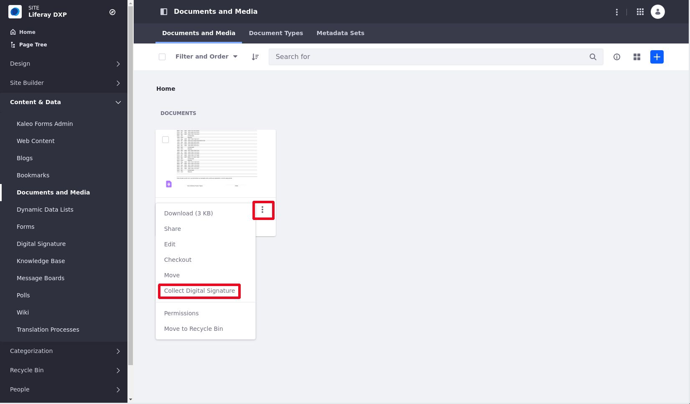
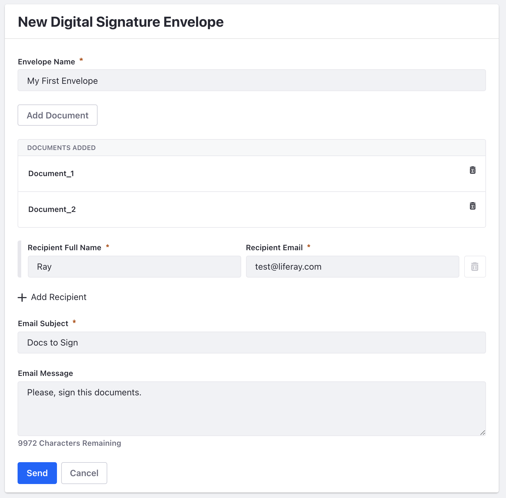
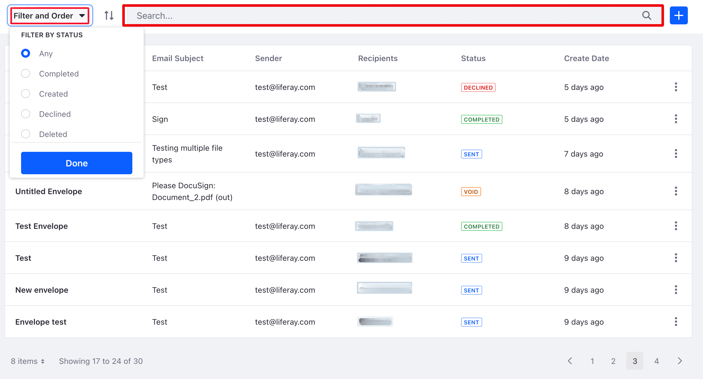
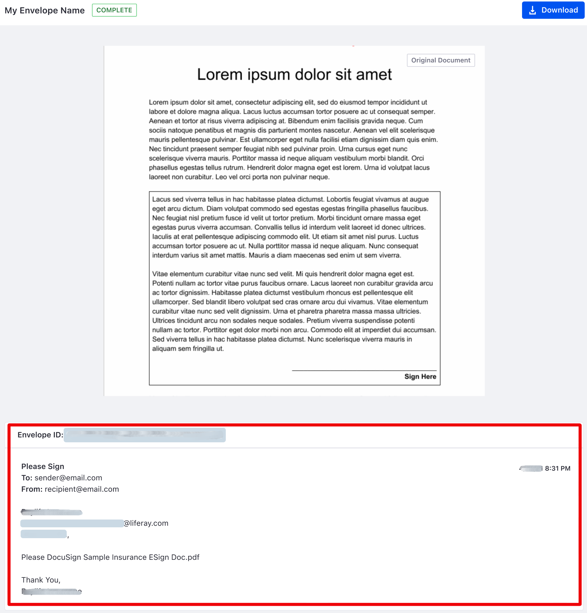

Enabling DocuSign Digital Signature

You can now integrate [*DocuSign*](https://www.docusign.com/) digital signature into your Liferay documents. DocuSign is a service that manages documents to be signed electronically. With this integration, you can manage and collect signatures on your documents.

Before you enable digital signature in Liferay, make sure you've generated and retrieved your User ID key, API Account key, Account Base URI, Integration key, and RSA Private key. Instructions for doing this can be found on [DocuSign's website](https://support.docusign.com/en/guides/ndse-admin-guide-api-and-keys). 

## Enabling Digital Signature

1. Open the Global menu on the top right corner. 

1. Click *Control Panel* &rarr; *Instance Settings* &rarr; *Digital Signature*. 

1. Switch the *toggle* to Enable.

    

1. You must choose a *Site Settings Strategy* (see below).

    

1. Click *Save*. 

You have three options for your Site settings strategy: 

**Always Inherit:** All sites are linked to these settings.

**Always Override:** Every site must provide its own configuration.

**Inherit or Override:** Can be defined in both site settings and instance settings. If defined in both, the site settings will override those of the instance.

You now must add your digital keys from DocuSign at the proper scope in Liferay. 

## Adding Digital Keys

Depending on what you chose for your Site Settings strategy, you must add your digital keys at the proper scope: 

- If you chose Always Inherit, add the keys in Instance Settings. 
- If you chose Always Override, add the keys in Site Settings. 
- If you chose Inherit or Override, add the keys in either place.

1. Navigate to _Control Panel_ &rarr; _Instance Settings_ &rarr; _Digital Signature_ or for Site Settings, the _Site Menu_ &rarr; _Configuration_ &rarr; _Site Settings_ &rarr; _Digital Signature_. 

1. If it's not switched already, switch the toggle to _Enabled_.

1. Enter the User ID, API Account ID, Account's Base URI, Integration Key, and the RSA Private Key you previously retrieved from the DocuSign website. 
1. Click *Save* to enable digital signature. 

## Adding Documents in Documents and Media

1. Open *Site Menu* () &rarr; *Content & Data* &rarr; *Documents and Media*. 

1. Add files clicking on the *Add Button* . 

## Collecting Document Signing in Documents and Media

1. Find the document you want to collect the digital signature and click *Actions* &rarr; *Collect Digital Signature*. 
1. For multiple documents, select the documents you want to collect the signatures and click on *Collect Digital Signature* . 

1. Fill the *Envelope*'s information and click on *Send*. 

1. Envelope sent, the recipient gets an email with the link of the document to sign. They have to click on *REVIEW DOCUMENTS* &rarr; check the box *I agree to use eletronic records and signatures.* &rarr; *CONTINUE* &rarr; *ADOPT AND SIGN* &rarr; *FINISH*. 

    >Your Digital Signature is automatically generated based on your full name and the initials you provide. 

1. The copy of the signed document goes back to you and the recipients.  

## Tracking Envelope's Status

DocuSign uses the term _envelope_ to denote a document or collection of documents to be signed. Once sent, you can track your envelope status from within Liferay. 
>You can check the different labels of status in [DocuSigns' website](https://support.docusign.com/en/guides/ndse-user-guide-document-status). 

1. Open the *Site Menu* () &rarr; _Content & Data_ &rarr; _Digital Signature_ to see a list of created envelopes. 

1. You can also create an envelope directly from this screen using the . You'll be brought to the envelope's screen to enter its information. 

1. Use *Filter and Order* or type keywords in the *Search* bar to organize the documents you visualize.    

1. Click on the name of the envelope to see its details and download the document by clicking on the *Download* button. 

<!--Some screenshots from this article have to be modified, because the feature is still under development, so we decided to write the doc anyway, send it to Rich and later change just the images not to delay the process -Eve and Fábio -->
    

    