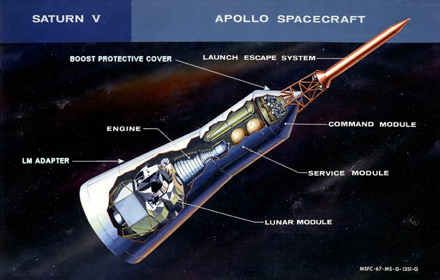
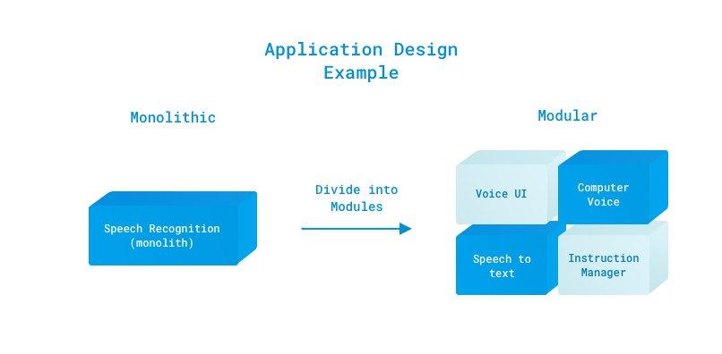
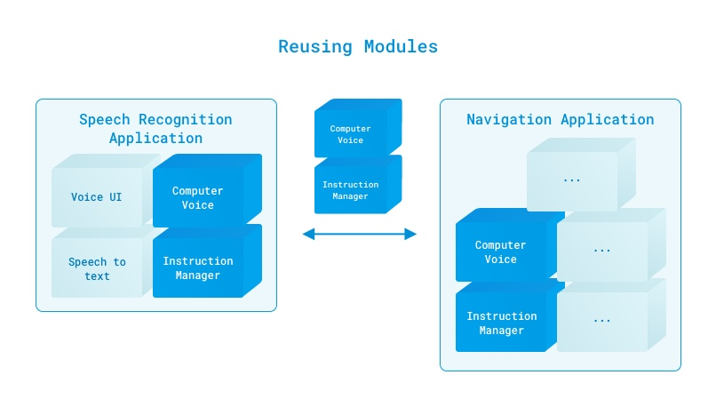

# The Benefits of Modularity

Dictionary.com defines [modularity](http://www.dictionary.com/browse/modularity) as *the use of individually distinct functional units, as in assembling an electronic or mechanical system.* The distinct functional units are called *modules*.

NASA's Apollo spacecraft, for example, comprised three modules, each with a distinct function:

* *Lunar Module*: Carried astronauts from the Apollo spacecraft to the moon's surface and back.
* *Service Module*: Provided fuel for propulsion, air conditioning, and water.
* *Command Module*: Housed the astronauts and communication and navigation controls.

The spacecraft and its modules exemplified these modularity characteristics:

* **Distinct functionality**: Each module provides a distinct function (purpose); modules can be combined to provide an entirely new collective function.

    The Apollo spacecraft's modules were grouped together for a distinct collective function: take astronauts from the Earth's atmospheric rim, to the moon's surface, and back to Earth. The previous list identifies each module's distinct function.

* **Dependencies**: Modules can require capabilities other modules satisfy.

    The Apollo modules had these dependencies:

    * Lunar Module depended on the Service Module to get near the moon.

    * Command Module depended on the Service Module for power and oxygen.
 
    * Service Module depended on the Command Module for instruction.

* **Encapsulation**: Modules hide their implementation details but publicly define their capabilities and interfaces.

    Each Apollo module was commissioned with a contract defining its capabilities and interface, while each module's details were encapsulated (hidden) from other modules. NASA integrated the modules based on their interfaces.

* **Reusability**: A module can be applied to different scenarios.

    The Command Module's structure and design were reusable. NASA used different versions of the Command Module, for example,  throughout the Apollo program, and in the Gemini Program, which focused on Earth orbit.

NASA used modularity to successfully complete over a dozen missions to the moon. Can modularity benefit software too? Yes!

## Modularity Benefits for Software

Java applications have predominantly been monolithic: they're developed in large code bases. In a monolith, it's difficult to avoid tight coupling of classes--changes to one class often requires changes to other classes. Modular application design, conversely, facilitates loose coupling, making the code easier to maintain. It's much easier and more fun to develop small amounts of cohesive code in modules. Here are some key benefits of developing modular software.

### Distinct Functionality

It's natural to focus on developing one piece of software at a time. In a module, you work on a small set of classes to define and implement the module's function. Keeping scope small facilitates writing high quality, elegant code. The more cohesive the code, the easier it is to test, debug, and maintain. Modules can be combined to provide a new function, distinguishable from each module's function.

### Encapsulation

A module encapsulates a function (capability). Module implementations are hidden from consumers, so you can create and modify them as you like. Throughout a module's lifetime, you can fix and improve the implementation or swap in an entirely new one. You make the changes behind the scenes, transparent to consumers. A module's contract defines its capability and interface, making the module easy to understand and use.

### Dependencies

Modules have requirements and capabilities. The interaction between modules is a function of the capability of one satisfying the requirement of another and so on. Modules are published to artifact repositories, such as Maven Central. Module versioning schemes let you specify dependencies on particular module versions or version ranges.

### Reusability

Modules that do their job well are hot commodities. They're reusable across projects, for different purposes. As you discover helpful reliable modules, you'll use them again and again.

It's time to design a modular application.

## Example: Designing a Modular Application

Application design often starts out simple but gets more complex as you determine capabilities the application requires. If a third party library already provides the capability, you can [deploy it with your app](../../liferay-internals/fundamentals/configuring-dependencies/resolving-third-party-library-package-dependencies.md). You can otherwise implement the capability yourself.

As you design various aspects of your app to support its function, you must decide how those aspects fit into the code base. Putting them in a single monolithic code base often leads to tight coupling, while designating separate modules for each aspect fosters loose coupling. Adopting a modular approach to application design lets you reap the modularity benefits.

For example, you can apply modular design to a speech recognition app. Here are the app's function and required capabilities:

*Function*: interface with users to translate their speech into text for the computer to understand.

*Required capabilities*:

* Translates user words to text.
* Uses a selected computer voice to speak to users.
* Interacts with users based on a script of instructions that include questions, commands, requests, and confirmations.

You could create modules to provide the required capabilities:

* *Speech to text*: Translates spoken words to text the computer understands.
* *Voice UI*: Interacts with users based on stored questions, commands, and confirmations.
* *Instruction manager*: Stores and provides the application's questions, commands, and confirmations.
* *Computer voice*: Stores and provides computer voices for users to choose from.

The following diagram contrasts a monolithic design for the speech recognition application with a modular design.

Designing the app as a monolith lumps everything together. There are no initial boundaries between the application aspects, whereas the modular design distinguishes the aspects.

You can create the modules in parallel, each one with its own particular capability. Designing applications that comprise modules fosters writing cohesive pieces of code that represent capabilities. Each module's capability can potentially be *reused* in other scenarios too.

For example, the *Instruction manager* and *Computer voice* modules can be *reused* by a navigation app.

Here are the benefits of designing the speech recognition app as modules:

* Each module represents a capability that contributes to the app's overall function.
* The app depends on modules, that are easy to develop, test, and maintain.
* The modules can be reused in different applications.

In conclusion, modularity has literally taken us to the moon and back. It benefits software development too. The example speech recognition application demonstrated how to design an app that comprises modules.

Next you'll learn how OSGi facilitates creating modules that provide and consume services.