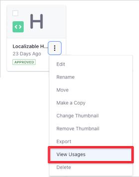
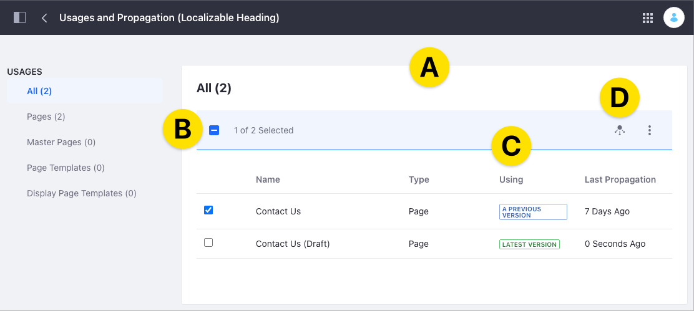
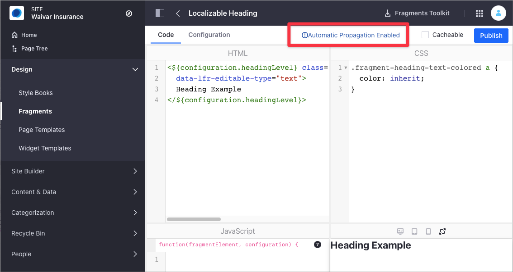

# Propagating Fragment Changes

By default, [changes to the Fragment's configuration](../../developer-guide/developing-page-fragments/using-the-fragments-editor.md) do not propagate automatically to the [Content Pages](./content-pages-overview.md) using the Fragment. For example, if you use a [Button Fragment](./using-fragments.md#button) of *Primary* type and then change the configuration to use a *Secondary* type, a Content Page using the Fragment does not reflect the change by default. Using *Fragment Propagation* you can modify this behavior and propagate your Fragment configuration changes to the elements where the Fragment exists.

```note::
   In addition to Content Pages, Propagation affects other elements where you use the Fragment, like Master Pages, Page Templates, and Display Page Templates. 
```

You can propagate the Fragment configuration changes in two different ways:

- [For a single Fragment](#propagating-the-fragment-configuration-for-a-single-fragment)
- [For of all the Fragments](#propagating-the-fragment-configuration-for-all-the-fragments)

## Propagating the Fragment Configuration for a Single Fragment

With this Propagation procedure, you can update all the elements where you use a Fragment with the most recent Fragment configuration. Use this procedure after [updating the Fragment](../../developer-guide/developing-page-fragments/using-the-fragments-editor.md) with the desired Configuration.

1. Go to *Site Administration* &rarr; *Site Builder* &rarr; *Fragments*.
1. Under *Collections*, click the Collection containing your Fragment.
1. On the Fragment, click the *Actions* () menu and select *View Usages*.

    

    ```tip::
       If the *View Usages* option is unavailable, the Fragment is not in use.
    ```

1. The *Usages and Propagation* list shows the elements containing the Fragment (A). Check the element or elements you want to update with the latest configuration. If you want to select all the elements, click *All* under *Usages* and check the box in the list header (B). The *Using* column (C) provides information about the Fragment configuration in use:

   - *Latest Version* --- The element uses already the latest Fragment configuration. You don't need to propagate changes to these elements.
   - *A Previous Version* --- The element uses a previous Fragment configuration.

1. Click the *Propagate* () button (D) to update the elements selected to the latest Fragment configuration.

    

## Propagating the Fragment Configuration for All the Fragments

Using this option, any Fragment [configuration change](../../developer-guide/developing-page-fragments/using-the-fragments-editor.md) propagates automatically to all the elements where the Fragment exists. To change this option you need access to the Liferay DXP [System Settings](../../../system-administration/configuring-liferay/system-settings.md).

1. Click on the *Global Menu* ().
1. Go to *Control Panel* &rarr; *Configuration* &rarr; *System Settings*.
1. Under the *Content and Data* section, click *Page Fragments*.
1. Check the *Propagate Fragment Changes Automatically* to enable Fragment Propagation for all your Fragments.
1. Click *Save*.

When you enable the *Propagate Fragment Changes Automatically*, the [Fragments Editor](../../developer-guide/developing-page-fragments/using-the-fragments-editor.md) notifies this condition using the *Fragment Propagation Enabled* message.



## Additional Information

- [Using Fragments](./using-fragments.md)
- [Configuring Fragment Styles](./configuring-fragment-styles.md)
- [Content Pages Overview](./content-pages-overview.md)
