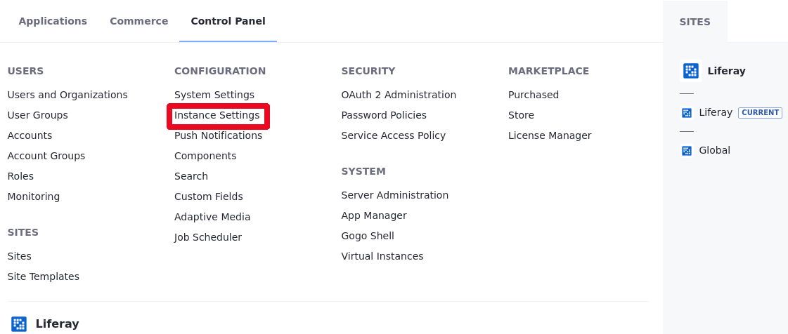
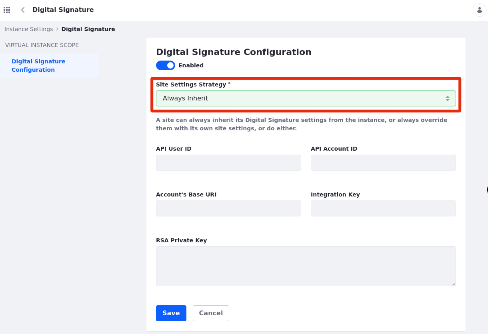
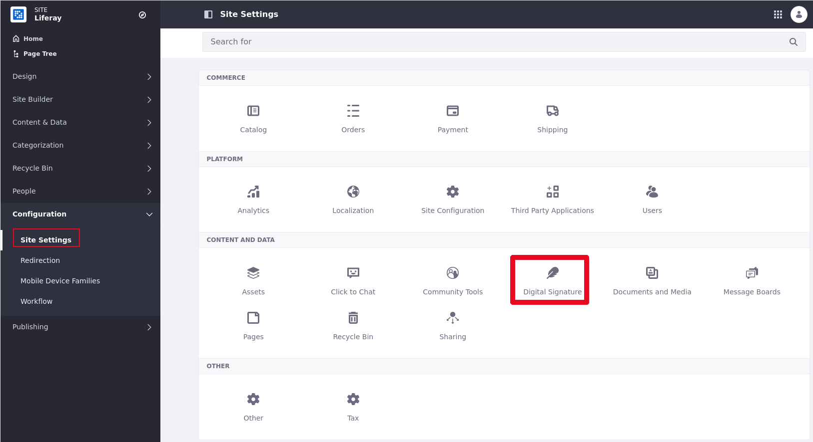
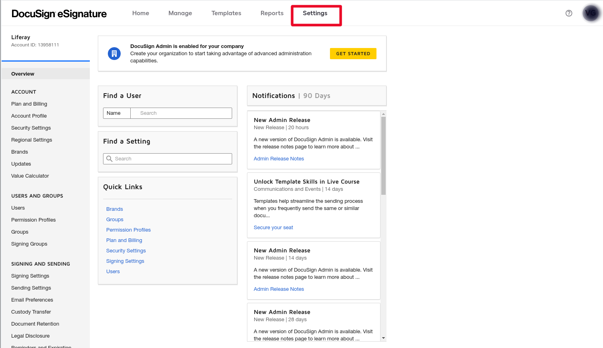


# Enabling Digital Signature

Liferay now offers an integration between [*DocuSign*](https://www.docusign.com/) and [Liferay's portal](https://www.liferay.com/home). DocuSign is a software that manages documents to be signed electronically. The main goal of this feature is help you manage and collect the signatures on your documents.

## Enabling DocuSign 

1. Open the Global menu on the top right corner. 

2. Click *Instance Settings* in the Control Panel.

    

3. Now, go to *Digital Signature*.

    

4. Switch the *toggle* to Enable.

    

5. You must choose a *Site Settings Strategy*.

    

    **Always Inherit:** All sites linked to these settings.

    **Always Override:** Every website will have to provide its own configuration.

    **Inherit or Override:** Can be defined in both site settings and instance settings. If defined in both, the site settings will override those of the instance.

6. When you choose *Always Inherit* all sites will be linked to these settings. After choosing this option click on *Save* and Digital Signature must be available at Liferay's Portal.

7. When you choose *Always Override* as your Site Settings Strategy, that means every website will have its own configuration. The website configuration must be done in your Site Settings. After choosing this option click on *Save*. 

8. When you choose *Inherit or Override*, that means your configuration has caracteristics of both options. It also means that you can set the configuration at instance settings and site settings. After choosing this option click on *Save*.  

9. After clicking on *Save*, go to the Site Settings page in the Configuration section.

10. Now go to *Digital Signature*.

11. Switch the *toggle* to Enable;

12. Now you need to input the User ID, API Account ID, Account's Base URI, Integration Key and the RSA Private Key DocuSign webSite.

13. Once finished, click *save* and then Digital Signature must be available on Liferay Portal.

## Getting the keys in DocuSign

1. Now, log into your [DocuSign account](https://account.docusign.com/oauth/auth?response_type=code&scope=all%20click.manage%20me_profile%20room_forms%20inproductcommunication_read%20data_explorer_signing_insights%20notary_read%20notary_write%20search_read%20search_write&client_id=2CC56DC9-4BCD-4B55-8AB0-8BA60BAE1065&redirect_uri=https%3A%2F%2Fapp.docusign.com%2Foauth%2Fcallback&state=%7B%22_ga%22%3A%222.118655759.764594398.1623180514-1139176039.1617134435%22%2C%22_gac%22%3A%221.229447918.1623246419.Cj0KCQjwzYGGBhCTARIsAHdMTQzcglmBh46xqjPM4dkiNQRuMKhi-gwyVf3j54T-CTJ70hdI_7Mp_kIaAgpFEALw_wcB%22%2C%22authTxnId%22%3A%2258fe6cdb-4162-4bc7-8827-594f0d8ce1c7%22%7D#/username) to get your account information.

2. Click on the *Settings tab* at the top of the page.

3. Scroll down the page and click on *Apps and Keys* in the *Integrations section*.

4. Now, you already got three out of five credentials you need: User ID key, API Account ID key and Account Base URI.

5. To get the other two you need to add an APP. Click on *ADD APP AND INTEGRATION KEY*. 

6. Input a name for that APP and click on *CREATE APP*.

7. The fourth credential, Integration key, is under the App's name.

8. To get the last credential, RSA Private Key, you need to add a pair of RSA keys. In the Service Integration section, click on *GENERATE RSA*

9. Look at the yellow warning, this information appears at that moment only, be sure to copy the information that you need otherwise you must create another app. Copy the Private Key. After that click on *Close*. 

10. To save this app, scroll the page down and click on *Save*.

11. Done! You already have all the credentials you need to enable the Digital Signature on Liferay's portal.

## How to use

1. In the *Home page*, open the *Application menu* 

2. In the Application Menu, click on *Content & Data* then click on *Documents and Media*.

3. Choose the document you want to assign, then click on the *Kebab button*. 

4. Now, click on *Collect Digital Signature*.

5. Fill the *Envelope*'s information and click on *Save*.

6. You can track the status of your envelope by clicking on *Digital Signature* in the Content & Data section in the Application menu.

7. You can click on the name of the envelope to see its details and download the document by clicking on the *Download* button.

8. You can also create an envelope directly from this screen using the *Add button*  

9. The *Document Library* is where you can upload your documents. You may select a file,  drag and drop a document, click on *Select File* or click on the *Add button*. 

10. Fill the rest of the envelope information and click on *Save* to create your envelope. After that your Digital Signature is set.

