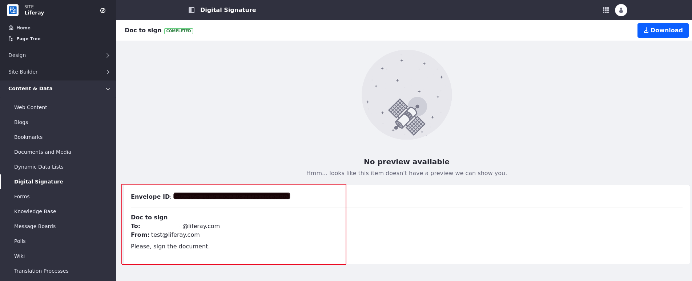

# Enabling DocuSign Digital Signatures

You can now integrate [*DocuSign*](https://www.docusign.com/) digital signatures into your Liferay documents. DocuSign is a service that manages documents to be signed electronically. With this integration, you can manage and collect signatures on your documents.

Before you enable digital signatures in Liferay, make sure you've generated and retrieved your User ID key, API Account key, Account Base URI, Integration key, and RSA Private key. Instructions for doing this can be found [on DocuSign's website](https://support.docusign.com/en/guides/ndse-admin-guide-api-and-keys). 

## Enabling Digital Signatures

1. Open the Global menu on the top right corner. 

1. Click *Control Panel* &rarr; *Instance Settings* &rarr; *Digital Signature*. 

1. Switch the *toggle* to Enable.

    

1. You must choose a *Site Settings Strategy* (see below).

    

1. Click *Save*. 

You have three options for your Site settings strategy: 

**Always Inherit:** All sites are linked to these settings.

**Always Override:** Every site must provide its own configuration.

**Inherit or Override:** Can be defined in both site settings and instance settings. If defined in both, the site settings will override those of the instance.

You now must add your digital keys from DocuSign at the proper scope in Liferay. 

## Adding Digital Keys

Depending on what you chose for your Site Settings strategy, you must add your digital keys at the proper scope: 

- If you chose Always Inherit, add the keys in Instance Settings. 
- If you chose Always Override, add the keys in Site Settings. 
- If you chose Inherit or Override, add the keys in either place.

1. Navigate to _Control Panel_ &rarr; _Instance Settings_ &rarr; _Digital Signature_ or for Site Settings, the _Site Menu_ &rarr; _Configuration_ &rarr; _Site Settings_ &rarr; _Digital Signature_. 

1. If it's not switched already, switch the toggle to _Enabled_.

1. Enter the User ID, API Account ID, Account's Base URI, Integration Key, and the RSA Private Key you previously retrieved from the DocuSign website. 

1. Click *Save* to enable digital signatures. 

## Enabling Document Signing in Documents and Media

1. Open the *Site Menu* () &rarr; *Content & Data* &rarr; *Documents and Media*.

1. Find the document you want to collect digital signatures for and click its *Actions* button.  Select _Collect Digital Signature_.

1. Fill the *Envelope*'s information and click on *Save*.

<!--The step above was the one spot that didn't seem clear to me, and you have no screenshot of it. Can you add one? -Rich -->

## Tracking Envelope Status

DocuSign uses the term _envelope_ to denote a document or collection of documents to be signed. Once sent, you can track your envelope status from within Liferay.

1. Open the *Site Menu* () &rarr; _Content & Data_ &rarr; _Digital Signature_ to see a list of created envelopes. 

1. Click on the name of the envelope to see its details and download the document by clicking on the *Download* button.

1. You can also create an envelope directly from this screen using the *Add button*. You'll be brought to Documents and Media to add a document and to enter the envelope information. 

 

<!-- This article seems to be missing the last step: what happens when you enter the envelope? Is an email sent to the recipient? Is there a link to the document in that email? Does that link go back to Liferay or to DocuSign? Are we notified when the documents are signed, or do we have to keep checking the status? You should describe the entire process so the reader can get a good picture of how the integration works. -Rich -->
