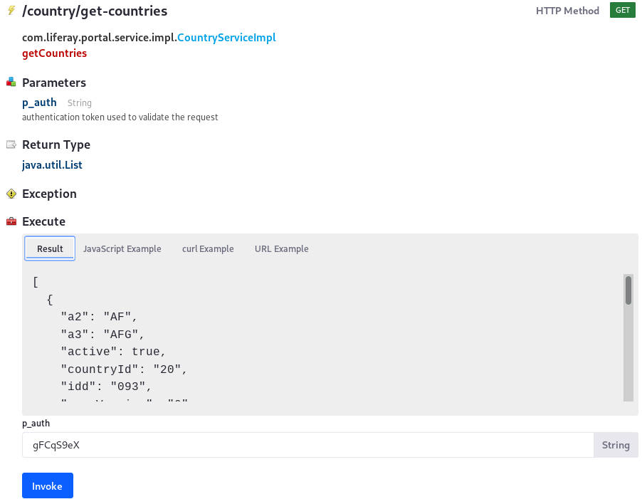
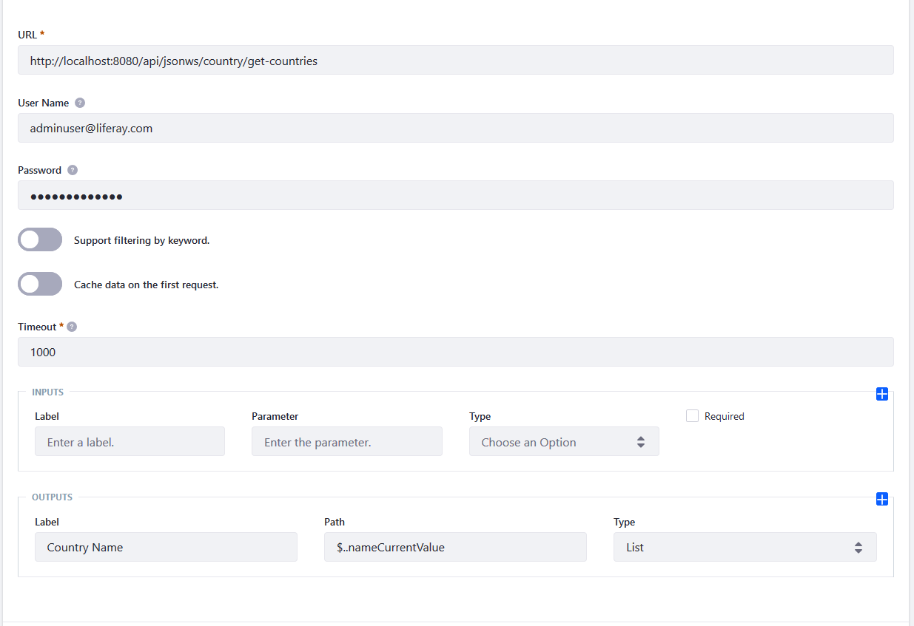
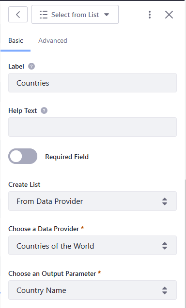
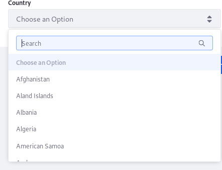

# Using the REST Data Provider to Populate Form Options

_Select from List_ fields can hold many options. Those options can be automatically supplied by using the JSON web services registered in Liferay DXP or any other third party REST web service. To learn more about data providers in general, see [Data Providers Overview](./data-providers-overview.md). This article walks users on how to invoke a JSON web service, configure the data provider, and add the data provider to a form.

## Prerequisites

One example is to populate a Select field for a user's "Country" when collecting personal information on a form.

[Create a form](../creating-and-managing-forms/creating-forms.md) that includes the following:

* **Country**: a Single Select field.

Next, use the `get-countries` JSON web service (there are two---use either one).

1. Navigate to [http://localhost:8080/api/jsonws](http://localhost:8080/api/jsonws).
1. Search for "get-countries".

    

1. Click _Invoke_.

The list of countries are now ready for use.

### Enabling Access to Data on the Local Network

By default, users cannot configure data providers to use URLs on the local network. This is a good default for security in a production environment, but makes testing more difficult.

To enable local network access from data providers:

1. Navigate to the _Control Panel_ &rarr; _Configuration_ &rarr; _System Settings_.
1. Click _Data Providers_ (under Content & Data).
1. Check the _Access Local Network_ checkbox.

    

1. Click _Save_ when finished.

## Adding a Basic Data Provider

To add a _Countries of the World_ Data Provider:

1. Open the _Product Menu_ () then click the compass icon () on the _Site Administration_ menu.
1. Select the site where the form is to be created.
1. Click _Content & Data_ &rarr; _Forms_.
1. Click the _Data Providers_ tab.

    

1. Click the Add button ().
1. Enter the following:

    * **Name**: Countries of the World
    * **URL**: `http://localhost:8080/api/jsonws/country/get-countries/`
    * **User Name**: `adminuser@liferay.com`
    * **Password**: adminuserpass
    * **Timeout**: 1000
    * **Outputs Label**: Country Name
    * **Outputs Path**: `$..nameCurrentValue`
    * **Outputs Type**: List

    

1. Click _Save_ when finished.

```note::
   ``$..`` before ``nameCurrentValue`` is the JsonPath syntax to navigate the JSON data structure and specify the path to the output. Learn more about `JsonPath <https://github.com/json-path/JsonPath>`_ and `here <http://goessner.net/articles/JsonPath/>`_.
```

## Using Inputs as Filters

The above example is simple which uses only an Output to populate a _Select from List field_. Often the response from the REST provider must be filtered before display in the Select from List field. For this, a Data Provider _Input_ field is required.

For example, to apply a region (for example, Americas, Europe, or Oceania) filter for the countries of the world:

1. Enter the following:
   * **Name**: `restcountries`
   * **URL**: `https://restcountries.eu/rest/v2/region/{region}?fields=name`(using a different REST provider)
   * **Input Label**: Region
   * **Parameter**: Region
   * **Input Type**: Text
   * **Outputs Label**: Countries of the World with Regions
   * **Outputs Path**: `*$..name*`
   * **Output Type**: List

    To understand more about these values, read the [Data Provider documentation](./data-providers-overview.md).

## Granting Data Provider Permissions

Depending on whether the user is required to be authenticated before filling the form, users may have to grant additional permissions to the Data Provider. For example, if Guests are to fill out the form, they need the _View_ permission, or else they will not be able to see the options provided by the data provider.

To configure the data provider's permissions:

1. Navigate to the _Site Administration_ &rarr; _Content & Data_ &rarr; _Forms_.
1. Click the Data Providers tab.
1. Click the Actions button (), then _Permissions_ next to the data provider.

    

1. Grant the necessary permissions.
1. Click _Save_ when finished.

## Using a Data Provider in a Select Field

Once the Data Provider is configured, use it to populate a Select from List field:

1. Click _Content & Data_ &rarr; _Forms_.
1. Drag a _Select from List_ field onto the form.
1. Select _From Data Provider_ from the Create List dropdown menu.
1. Select _Countries of the World_ from the Choose a Data Provider dropdown menu.
1. Select _Country Name_ from the Choose an Output Parameter dropdown menu.

    

1. Click _Save Form_ when finished.

The Data Provider is now being used to populate a select field.



## Troubleshooting Data Provider Errors

To uncover errors arising from Data Provider failures, [configure log levels](../../../system-administration/using-the-server-administration-panel/configuring-logging.md) for these services:

1. Navigate to the _Control Panel_ &rarr; _System_ &rarr; _Server Administration_.
1. Click the _Log Levels_ tab.
1. Add the logging category `com.liferay.dynamic.data.mapping.data.provider.internal.DDMDataProviderInvokerImpl` and configure it to log at the _WARN_ level. _Save_ when finished.
1. Add the logging category `com.liferay.dynamic.data.mapping.form.field.type.internal.DDMFormFieldOptionsFactoryImpl` and configure it to log at the _WARN_ level. _Save_ when finished.
 
The console now sends warning messages whenever there are errors in the Data Provider.

## Additional Information

* [Data Providers Overview](./data-providers-overview.md)
* [Using the Autofill Rule](../form-rules/using-the-autofill-rule.md)
